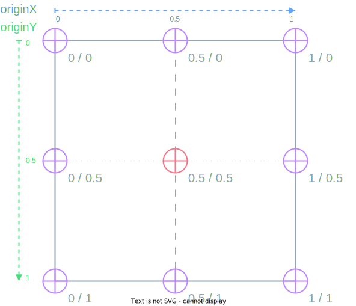

This page serves as a reference for the available markdown options in the docs.

## Diagrams

### Android Runtime Overview


### iOS Runtime Overview


### Frame and Page Lifecycle


### View Origin



### Android View Lifecycle


- OnLayoutChangeListener

### StackLayout (exploration)

<DeviceFrame type="ios">

</DeviceFrame>

## Videos

### View Origin Demo

<DeviceFrame type="ios">
<video style="max-width: 400px;" muted="true" disablepictureinpicture="true" autoplay="true" loop="true" src="./assets/videos/animation_origin_ios.mp4"/>
</DeviceFrame>
<DeviceFrame type="android">
<video style="max-width: 400px;" muted="true" disablepictureinpicture="true" autoplay="true" loop="true" src="./assets/videos/animation_origin_android.mp4"/>
</DeviceFrame>

## Frontmatter

The top of the markdown file contains a section surrounded by `---` this part is called the frontmatter, and it is used to set a few things on a page. For example:

```md
---
title: Some title
---

<!-- the rest of the markdown -->
```

Available options:

```md
---
title: controls the h1 page title and the title in the browser tab bar
description: the page description, shown below the title and set in the description meta tags
category: the name/text of the page category, show in the breadcrumbs and above the title
categoryLink: the link where the custom category should link to
prev: the URL where the `Previous` button at the bottom should link to
prevText: the text to show in the `Previous` button. By default the text is looked up in the sidebar.
next: the URL where the `Next` button at the bottom should link to
nextText: the text to show in the `Next` button. By default the text is looked up in the sidebar.
contributors: false # to disable the contributors list in the right sidebar
contributors:
 - GitHubUsername1
 - GitHubUsername2
---

<!-- the rest of the markdown -->
```

## Images/Assets handling

Images and assets should be placed in the `content/assets` folder. Generally in a directory named the same as the page.

For example, if we have a page at `/setup/windows` the assets for this page would go in `assets/images/setup/windows/`.

This is not a hard-limitation, and can be switched up when necessary.

### Referencing images in Markdown

To show the images in markdown, use the standard markdown image markup `` where the path is relative to the markdown file itself.

For example:

```md
<!-- content/setup/windows.md -->


```

## Tabs

:::warning

In order to render Markdown inside a tab, you **must** have one line break above and below the markdown content.

For example:

```xml
<Tab>
  # Test
</Tab>
```

Will render `# Test` literally, while

```xml
<Tab>

  # Test

</Tab>
```

Will render a `h1` Test title.

:::

<Tabs>
  <Tab title="Simple Tab">
  This is the most basic tab there is. Pure html content or whatever.
  </Tab>

  <Tab title="With Code Block">
  
  ```ts
  console.log('Hello World!')
  ```
  
  </Tab>

  <Tab title="With External Code Block">

<<< @/../examples/typescript/src/ui/ActionBar/page.xml#example

  </Tab>

  <Tab title="With Two Ext-Code Blocks">

<<< @/../examples/typescript/src/ui/ActionBar/page.xml#example

And another one:

<<< @/../examples/typescript/src/ui/ActionBar/page.xml#example

  </Tab>
</Tabs>

### Flavor Tabs

<Tabs>
<Tab flavor="vue">
This is the vue tab
</Tab>
<Tab flavor="typescript">
This is the typescript tab
</Tab>
<Tab flavor="javascript">
This is the javascript tab
</Tab>
<Tab flavor="angular">
This is the angular tab
</Tab>
<Tab flavor="svelte">
This is the svelte tab
</Tab>
<Tab flavor="react">
This is the react tab
</Tab>
<Tab flavor="solid">
This is the solid tab
</Tab>

</Tabs>

All Flavor tabs will be synchronized and ordered consistently:

<Tabs>
<Tab flavor="typescript">
This is the typescript tab
</Tab>
<Tab flavor="javascript">
This is the javascript tab
</Tab>
<Tab flavor="angular">
This is the angular tab
</Tab>
<Tab flavor="svelte">
This is the svelte tab
</Tab>
<Tab flavor="react">
This is the react tab
</Tab>
<Tab flavor="vue">
This is the vue tab
</Tab>
<Tab flavor="solid">
This is the solid tab
</Tab>
</Tabs>

## StepList

To notate steps from a screenshot, or steps in general, you can wrap any list with the `<StepList>` component to style the list.

**Example**:

```md
<StepList>

1. This is a test step list, that should render the bullets on the left in a red circle
2. This is the second step
3. Then there's the **third** step
4. And a **fourth**
5. It can go...
6. On, and on...
7. And on and on...
8. Until we run out of things to say
9. But the list should handle **double digit** step counters just fine, as well as lines that wrap to multiple lines in case we have lots of words to say about a given step, beause sometimes steps just need that extra bit of explanation to properly make sense to the reader.
10. Finally, we can see those **double digits** in action right here.

</StepList>
```

:::warning Important
Note the blank lines above and below the markdown list, this is required due to the way Markdown is parsed when combined with "html" elements.
:::

---

<StepList>

1. This is a test step list, that should render the bullets on the left in a red circle
2. This is the second step
3. Then there's the **third** step
4. And a **fourth**
5. It can go...
6. On, and on...
7. And on and on...
8. Until we run out of things to say
9. But the list should handle **double digit** step counters just fine, as well as lines that wrap to multiple lines in case we have lots of words to say about a given step, beause sometimes steps just need that extra bit of explanation to properly make sense to the reader.
10. Finally, we can see those **double digits** in action right here.

</StepList>

## DeviceFrame

To make content pretty, you can wrap it in a device frame

### iOS Frame

<DeviceFrame type="ios">

</DeviceFrame>

### Android Frame

<DeviceFrame type="android">

</DeviceFrame>

### Generic Window Frame

Props:

- `title: string | false` - sets a custom window title
- `buttons: boolean` - hide window buttons

<DeviceFrame type="window" >
<video controls src="https://user-images.githubusercontent.com/879060/230395606-dbb4a56f-74e8-403b-a687-62e27a61f8d4.mov"></video>
</DeviceFrame>

---

<DeviceFrame type="window" :buttons="false" title="Hello World!">

<div class="p-4">
No Buttons & Custom Title
</div>

</DeviceFrame>
