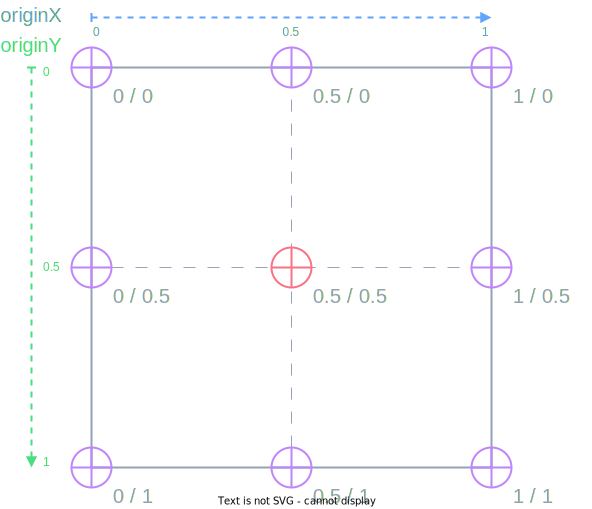

<!-- TODO: SB+Preview with Animation class example -->

NativeScript exposes a simple yet powerful API to allow animating almost every native component in your app. The singular API allows you to animate both iOS and Android the same way. You always have the discretion to use platform animations directly where desired but let's look at how comprehensive this simple API is as it is well suited for a large majority of commonly desired animations.

For your convenience, there are two popular ways of creating animations:

- [Declarative](#declarative-animating-ui-components-with-css) - easy and familiar CSS3 animations API
- [Imperative](#imperative-animating-ui-components-with-code) - take full control of any animation by calling animation methods directly with code

## Declarative: Animating UI components with CSS

CSS animations are based on the [CSS3 animations API](http://www.w3schools.com/css/css3_animations.asp) standard. You can use them to animate almost every native view without even having to know JavaScript. You can use multiple frames and change the animation direction. With CSS animations, you can separate the animation code from your app logic if desired.

CSS animations consist of two components: a style describing the CSS animation and a set of keyframes that indicate the start and end states of the animation's style, as well as possible intermediate waypoints.

Add animation with `@keyframes` in CSS as follows:

```css
@keyframes example {
  from {
    background-color: red;
  }
  to {
    background-color: green;
  }
}

.example {
  animation-name: example;
  animation-duration: 4s;
  animation-fill-mode: forwards;
}
```

The animation starts as soon as the component with the `.example` class is loaded.

To trigger it later, set the component's `className` property to `.view` where you want the animation to start:

```typescript
button.className = 'example'
```

```xml
<Button id="myButton" text="{N}" />
```

:::tip Note

If the `animation-duration` property is not specified, the animation will use a default value - 0.3 seconds.

:::

A basic `@keyframes` rule has two waypoints. The `from` property represents `0%` (the start) of the animation time and `to` represents the 100% (the final value).

```css
@keyframes example {
  from {
    background-color: red;
  }
  to {
    background-color: green;
  }
}
```

You can add more waypoints using percent(%).

```css
@keyframes example {
  0% {
    background-color: red;
    transform: translate(0, 0);
  }
  25% {
    background-color: yellow;
    transform: translate(200, 0);
  }
  50% {
    background-color: blue;
    transform: translate(200, 200);
  }
  75% {
    background-color: green;
    transform: translate(0, 200);
  }
  100% {
    background-color: red;
    transform: translate(0, 0);
  }
}
```

### Animatable properties

CSS animations in NativeScript support the same animatable properties used in code-based animations:

- `opacity`
- `background-color`: Corresponds with the `backgroundColor`.
- `transform: translate`: Corresponds with `translateX` and `translateY` properties.
- `transform: scale`: Corresponds with `scaleX` and `scaleY` properties.
- `transform: rotate`: Corresponds with the `rotate` property.

:::tip Note

You cannot set a single x or y field in scale and translate. If you set only x in translate, y will be assumed 0; If you set only y in scale, x will be assumed 1.

:::

### CSS Animation properties

A CSS animation is defined by using the `animation` property and its sub-properties in the following list. The actual animation appearance is defined with the `@keyframes` rule.

- `animation-name`: Specifies the name of the `@keyframes` rule that should be used.
- `animation-delay`: Specifies the time between the style is applied and the beginning of the animation.
- `animation-duration`: The length of the animation in seconds.
- `animation-iteration-count`: Specifies how many times the animation should be played. Default is 1. To repeat an animation forever, use infinite.
- `animation-timing-function`: Defines how the animation transitions through keyframes by establishing acceleration curves.
- `animation-fill-mode`: Configures what values are applied by the animation to the view component when it ends.
- `animation-direction`: Configures whether or not the animation should alternate direction on each run through the sequence or reset to the start point and repeat itself.
- `animation`: The shorthand property allows setting all animation properties in a single line.

### Setting animation delay

The `animation-delay` property specifies a delay (in seconds) before the animation starts:

```css
.view {
  ....
  animation-delay: 2s;
}
```

### Setting animation iterations

The `animation-iteration-count` property defines the number of times an animation should run. The animation with the below value will play two times before it stops.

```css
.view {
  ....
  animation-iteration-count: 2;
}
```

For infinite animation, set this property to `infinite`.

```css
animation-iteration-count: infinite;
```

### Setting the speed curve of the animation

The `animation-timing-function` property specifies the speed curve of the animation. It can have one of the following values:

- `ease`: Specifies an animation with a slow start, then fast, then end slowly (this is the default).
- `linear`: Specifies an animation with the same speed from start to end.
- `ease-in`: Specifies an animation with a slow start.
- `ease-out`: Specifies an animation with a slow end.
- `ease-in-out`: Specifies an animation with a slow start and slow end.
- `spring`: Specifies a spring animation.
- `cubic-bezier(n,n,n,n)`: Lets you define your own values in a cubic-bezier function, as shown below:

```css
.view {
  ...
  animation-timing-function: cubic-bezier(0.1, 0.1, 1, 1);
}
```

### Setting animation end state

The `animation-fill-mode` property determines the end-of-animation style for the component. Its default value is `none`. In this case, all animated values will be reset to the state they had before the animation. To preserve the animation values, set `forwards`:

```css
.view {
...
  animation-fill-mode: forwards;
}
```

### Animation property shorthand

To set all the properties above in a single line, use the `animation` property:

```css
.view {
  animation: example 4s ease-in-out 2s infinite reverse forwards;
}
```

The order of properties are as follows:

`animation`: `name` `duration` `timing-function delay` `iteration-count` `direction` `fill-mode`;

You can combine two animations in the `animation` property by using commas:

```css
.view {
  animation: example 4s ease-in-out 2s infinite reverse, second-animation-example
      5s ease-out;
}
```

### Pseudo selectors

The `Button` component has a built-in special state `highlighted` to for the `touch` event. Set animation for that state as follows:

```css
.button {
  background-color: green;
}

.button:highlighted {
  animation-name: highlight;
  animation-duration: 2s;
  animation-fill-mode: forwards;
}

@keyframes highlight {
  from {
    background-color: yellow;
  }
  to {
    background-color: red;
  }
}
```

### Animating width and height

<!-- TODO: add flavors -->
<!-- /// flavor plain

```xml
<GridLayout rows="* *" columns="*" class="home-panel">
  <StackLayout row="0">
    <Label text="{N}" class="big-label first-view" textWrap="true" />
  </StackLayout>
  <StackLayout row="1">
    <Label text="{N}" class="big-label second-view" textWrap="true" />
  </StackLayout>
</GridLayout>
```

```css
.first-view {
  animation-name: example-width;
  animation-duration: 5s;
  animation-fill-mode: forwards;
}

.second-view {
  animation-name: example-height;
  animation-duration: 5s;
  animation-fill-mode: forwards;
}

@keyframes example-width {
  from {
    width: 140;
  }
  to {
    width: 200;
  }
}

@keyframes example-height {
  from {
    height: 140;
  }
  to {
    height: 200;
  }
}
```

[Demo](https://play.nativescript.org/?template=play-js&id=xe3lMf)

///

/// flavor angular

```html
<GridLayout rows="* *" columns="*" class="home-panel">
  <StackLayout row="0">
    <label text="{N}" class="big-label first-view" textWrap="true"></label>
  </StackLayout>
  <StackLayout row="1">
    <label text="{N}" class="big-label second-view" textWrap="true"></label>
  </StackLayout>
</GridLayout>
```

```css
.first-view {
  animation-name: example-width;
  animation-duration: 5s;
  animation-fill-mode: forwards;
}

.second-view {
  animation-name: example-height;
  animation-duration: 5s;
  animation-fill-mode: forwards;
}

@keyframes example-width {
  from {
    width: 140;
  }
  to {
    width: 200;
  }
}

@keyframes example-height {
  from {
    height: 140;
  }
  to {
    height: 200;
  }
}
```

[Demo](https://play.nativescript.org/?template=play-ng&id=NMM4I5)

///
 -->

## Imperative: Animating UI components with code

The easiest way to animate a single [View](https://docs.nativescript.org/api/class/View) is by using the `View.animate` method which accepts an [`AnimationDefinition`](https://docs.nativescript.org/api/interface/AnimationDefinition). It immediately starts and returns its finished promise.

```typescript
view.animate({
  translate: { x: 0, y: 100 },
  duration: 1000,
  curve: CoreTypes.AnimationCurve.easeIn,
})
```

:::tip Note

You should create an [Animation](#the-animation-class) class in order to be able to **cancel** the animation.

:::

### The AnimationDefinition interface

The [AnimationDefinition](https://docs.nativescript.org/api/interface/AnimationDefinition) interface defines the following properties to be animated:

- `target`: The view whose property is to be animated.
- `opacity`: Animates the opacity of the view. Value should be a number between 0.0 and 1.0.
- `backgroundColor`: Animates the backgroundColor of the view.
- `translate`: Animates the translate affine transform of the view. Value should be `{ x: number; y: number; }`
- `scale`: Animates the scale affine transform of the view. Value should be `{ x: number; y: number; }`
- `rotate`: Animates the rotate affine transform of the view. Value should be a number specifying the rotation amount in degrees.
- `duration`: The length of the animation in milliseconds. The default duration is 300 milliseconds.
- `delay`: The amount of time, in milliseconds, to delay starting the animation.
- `iterations`: Specifies how many times the animation should be played. Default is 1. iOS animations support fractional iterations, i.e., 1.5. To repeat an animation infinitely, use `Number.POSITIVE_INFINITY`.
- `curve`: An optional animation curve. Possible values are contained in the [CoreTypes.AnimationCurve](https://github.com/NativeScript/NativeScript/blob/8d25d251cd1c311d3f73e526bf2fd4ee0b2be0b8/packages/core/core-types/index.ts#L268). Alternatively, you can pass an instance of type [`UIViewAnimationCurve`](https://developer.apple.com/documentation/uikit/uiviewanimationcurve?language=objc) for iOS or [`android.animation.TimeInterpolator`](https://developer.android.com/reference/android/animation/TimeInterpolator) for Android.
- `width`: Animates view's width.
- `height`: Animates view's height.

All members of the interface are **optional** and have default values with the following exceptions:

- `target` is only optional when calling the `animate` method of a [`View`](https://docs.nativescript.org/api/class/View) instance since it is set automatically for you.
- You must specify at least one of: opacity, backgroundColor, scale, rotate or translate.

### The Animation class

The [`Animation`](https://docs.nativescript.org/api/class/Animation) class represents a set of one or more [AnimationDefinitions](#the-animationdefinition-interface) that can be played either simultaneously or sequentially. The constructor of the `Animation` class accepts an array of `AnimationDefinitions` and a boolean parameter indicating whether to play the animations sequentially. Creating an instance of the `Animation` class does not start the animation playback. Call the `play` method to start the animation.

- `play`: A method that starts the animation and returns the instance it was called on for fluent animation chaining.
- `cancel`: A void method that stops the animation.
- `finished`: A promise that will be resolved when the animation finishes or rejected when the animation is cancelled or stops for another reason.
- `isPlaying`: A boolean property returning `true` if the animation is currently playing.

### Animating from a different component's origin

A view has the `originX` and `originY` properties. By default, they have a value of 0.5. To create complex rotation animations, you can change those properties. The pair represents the origin point around which the view will be transformed.



### Chaining animations with promises

Use the promise returned by the `animate` method to chain animations:

```typescript
view
  .animate({ opacity: 0 })
  .then(() => view.animate({ opacity: 1 }))
  .then(() => view.animate({ translate: { x: 100, y: 100 } }))
  .then(() => view.animate({ translate: { x: 0, y: 0 } }))
  .then(() => view.animate({ scale: { x: 3, y: 3 } }))
  .then(() => view.animate({ scale: { x: 1, y: 1 } }))
  .then(() => view.animate({ rotate: 180 }))
  .then(() => view.animate({ rotate: 0 }))
  .then(() => {
    console.log('Animation finished')
  })
  .catch((e) => {
    console.log(e.message)
  })
```

<!-- todo: missing gif. -->
<!--  -->

### OR

### Access CSS animations from code

To trigger an animation defined in CSS, you can change the view's `className` property:

```ts
const view = page.getViewById('view')
view.className = 'transparent'
```

To access `@keyframes` defined in CSS, use the `Page` view's `getKeyframeAnimationWithName` method. This allows for further customization of animation properties:

```ts
import { KeyframeAnimation, View } from '@nativescript/core'

const view = page.getViewById('view') as View
const animationInfo = page.getKeyframeAnimationWithName('bounce')
animationInfo.duration = 2000

const animation = KeyframeAnimation.keyframeAnimationFromInfo(animationInfo)
animation.play(view).then(() => {
  console.log('Played with code!')
})
```

### TouchManager 8.2+

The `TouchManager` provides several conveniences for your apps interaction.

### Auto animate touch down/up for all tap bindings

For example, you can easily and quickly enable consistent touch down/up animations on every view which has a `tap` event binding throughout your entire app by enabling `TouchManager.enableGlobalTapAnimations` before your app bootstraps (typically in `app.ts` or `main.ts`):

```ts
import { TouchManager } from '@nativescript/core'

TouchManager.enableGlobalTapAnimations = true
TouchManager.animations = {
  down: {
    scale: { x: 0.95, y: 0.95 },
    duration: 200,
    curve: CoreTypes.AnimationCurve.easeInOut,
  },
  up: {
    scale: { x: 1, y: 1 },
    duration: 200,
    curve: CoreTypes.AnimationCurve.easeInOut,
  },
}

// bootstrap the app...
```

This would auto animate any view with a `tap` binding with those specific animations on touch down and up.

If you have a few "tappable" views that need to be ignored:

```xml
<Button text="Global tap animations simply ignored" ignoreTouchAnimation="true" />
```

In addition to expressing NativeScript [Animation APIs](https://docs.nativescript.org/interaction.html#animations) which are convenient, simple and easy you can also define purely native animations like [iOS UIView Animations](https://developer.apple.com/documentation/uikit/uiview/1622418-animate) or even [Android Dynamic Spring Physics Animations](https://developer.android.com/guide/topics/graphics/spring-animation), for example:

```ts
touchAnimation = {
  down(view: View) {
    if (global.isIOS) {
      UIView.animateWithDurationAnimations(0.25, () => {
        view.ios.transform = CGAffineTransformMakeScale(0.95, 0.95)
      })
    } else if (global.isAndroid) {
      const lib = androidx.dynamicanimation.animation
      const spring = new lib.SpringForce(0.95)
        .setDampingRatio(lib.SpringForce.DAMPING_RATIO_MEDIUM_BOUNCY)
        .setStiffness(lib.SpringForce.STIFFNESS_MEDIUM)
      let animation = new lib.SpringAnimation(
        view.android,
        lib.DynamicAnimation().SCALE_X,
        float(0.95)
      )
      animation.setSpring(spring).setStartVelocity(0.7).setStartValue(1.0)
      animation.start()
      animation = new lib.SpringAnimation(
        view.android,
        lib.DynamicAnimation().SCALE_Y,
        float(0.95)
      )
      animation.setSpring(spring).setStartVelocity(0.7).setStartValue(1.0)
      animation.start()
    }
  },
  up(view: View) {
    if (global.isIOS) {
      UIView.animateWithDurationAnimations(0.25, () => {
        view.ios.transform = CGAffineTransformIdentity
      })
    } else if (global.isAndroid) {
      const lib = androidx.dynamicanimation.animation
      const spring = new lib.SpringForce(1)
        .setDampingRatio(lib.SpringForce.DAMPING_RATIO_MEDIUM_BOUNCY)
        .setStiffness(lib.SpringForce.STIFFNESS_MEDIUM)
      let animation = new lib.SpringAnimation(
        view.android,
        lib.DynamicAnimation().SCALE_X,
        float(1)
      )
      animation.setSpring(spring).setStartVelocity(0.7).setStartValue(0.95)
      animation.start()
      animation = new lib.SpringAnimation(
        view.android,
        lib.DynamicAnimation().SCALE_Y,
        float(1)
      )
      animation.setSpring(spring).setStartVelocity(0.7).setStartValue(0.95)
      animation.start()
    }
  },
}
```

### touchAnimation and ignoreTouchAnimation

You can also declaratively define custom touch animations on any specific view (_which overrides any global TouchManager settings_) by specifying it's own `touchAnimation` property:

```xml
<Button touchAnimation="{{ touchAnimation }}" />
```

This would animate touch down and up with the following view binding settings:

```ts
touchAnimation = {
  down: {
    scale: { x: 0.95, y: 0.95 },
    backgroundColor: new Color('yellow'),
    duration: 250,
    curve: CoreTypes.AnimationCurve.easeInOut,
  },
  up: {
    scale: { x: 1, y: 1 },
    backgroundColor: new Color('#63cdff'),
    duration: 250,
    curve: CoreTypes.AnimationCurve.easeInOut,
  },
}
```

When using `TouchManager.enableGlobalTapAnimations` you can declare any views to be ignored in cases where a couple may need to be excluded from your global animation settings:

```xml
<Button text="Global tap animations simply ignored" ignoreTouchAnimation="true" />
```

## Limitations

- `Span` and `FormattedString` can not be animated. `Span` and `FormattedString` components are not extending the [`View`](https://docs.nativescript.org/api/class/View) class, but only [`ViewBase`](https://docs.nativescript.org/api/class/ViewBase). Because of this, neither `Span` nor `FormattedString` are ui components, making it impossible to animate them and causing a crash on iOS.
