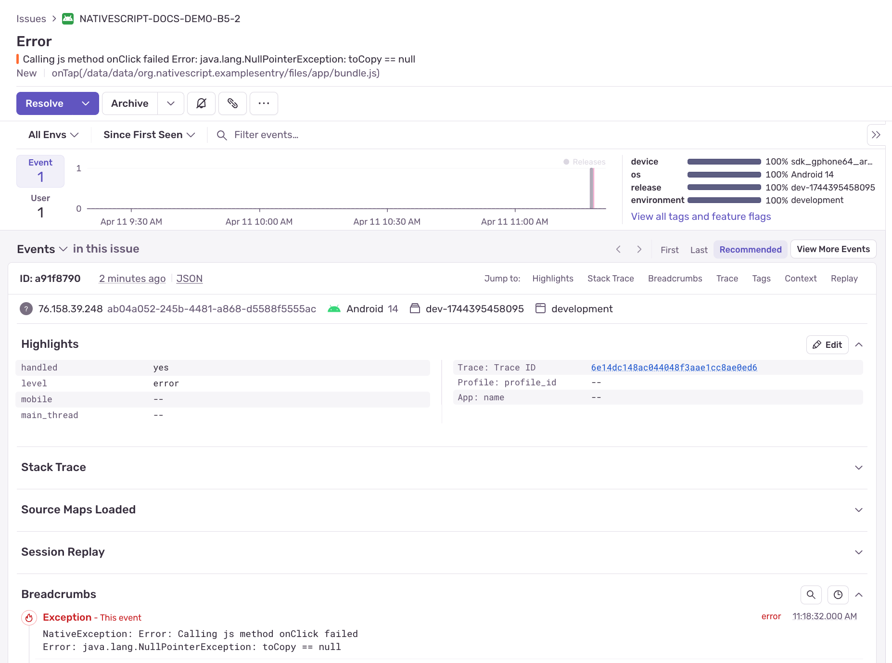

<svg class="css-lfbo6j e1igk8x04" xmlns="http://www.w3.org/2000/svg" viewBox="0 0 222 66" width="400" height="119"><path d="M29,2.26a4.67,4.67,0,0,0-8,0L14.42,13.53A32.21,32.21,0,0,1,32.17,40.19H27.55A27.68,27.68,0,0,0,12.09,17.47L6,28a15.92,15.92,0,0,1,9.23,12.17H4.62A.76.76,0,0,1,4,39.06l2.94-5a10.74,10.74,0,0,0-3.36-1.9l-2.91,5a4.54,4.54,0,0,0,1.69,6.24A4.66,4.66,0,0,0,4.62,44H19.15a19.4,19.4,0,0,0-8-17.31l2.31-4A23.87,23.87,0,0,1,23.76,44H36.07a35.88,35.88,0,0,0-16.41-31.8l4.67-8a.77.77,0,0,1,1.05-.27c.53.29,20.29,34.77,20.66,35.17a.76.76,0,0,1-.68,1.13H40.6q.09,1.91,0,3.81h4.78A4.59,4.59,0,0,0,50,39.43a4.49,4.49,0,0,0-.62-2.28Z M124.32,28.28,109.56,9.22h-3.68V34.77h3.73V15.19l15.18,19.58h3.26V9.22h-3.73ZM87.15,23.54h13.23V20.22H87.14V12.53h14.93V9.21H83.34V34.77h18.92V31.45H87.14ZM71.59,20.3h0C66.44,19.06,65,18.08,65,15.7c0-2.14,1.89-3.59,4.71-3.59a12.06,12.06,0,0,1,7.07,2.55l2-2.83a14.1,14.1,0,0,0-9-3c-5.06,0-8.59,3-8.59,7.27,0,4.6,3,6.19,8.46,7.52C74.51,24.74,76,25.78,76,28.11s-2,3.77-5.09,3.77a12.34,12.34,0,0,1-8.3-3.26l-2.25,2.69a15.94,15.94,0,0,0,10.42,3.85c5.48,0,9-2.95,9-7.51C79.75,23.79,77.47,21.72,71.59,20.3ZM195.7,9.22l-7.69,12-7.64-12h-4.46L186,24.67V34.78h3.84V24.55L200,9.22Zm-64.63,3.46h8.37v22.1h3.84V12.68h8.37V9.22H131.08ZM169.41,24.8c3.86-1.07,6-3.77,6-7.63,0-4.91-3.59-8-9.38-8H154.67V34.76h3.8V25.58h6.45l6.48,9.2h4.44l-7-9.82Zm-10.95-2.5V12.6h7.17c3.74,0,5.88,1.77,5.88,4.84s-2.29,4.86-5.84,4.86Z" transform="translate(11, 11)" fill="#362d59"></path></svg>

Gain critical insights into app issues by integrating [Sentry](https://sentry.io), an advanced error tracking and performance monitoring service. Follow this guide to set up Sentry in your NativeScript application using the [@nativescript-community/sentry](https://github.com/nativescript-community/sentry) plugin.

---

## Step 1: Create a Sentry Account and Project

First, [sign up](https://sentry.io) for a Sentry account and create a new project specifically for your NativeScript app.

## Step 2: Install the Plugin

Install the Sentry SDK into your NativeScript project:

```bash
npm install @nativescript-community/sentry
```

## Step 3: Set Up Environment Variables

Create a `.env` file at the root of your project with these Sentry-related variables:

- **`SENTRY_ORG_SLUG`**: Found under your project's Organization Settings.
- **`SENTRY_PROJECT_SLUG_IOS` & `SENTRY_PROJECT_SLUG_ANDROID`**: Identifiers for your iOS and Android projects.
- **`SENTRY_DSN_IOS` & `SENTRY_DSN_ANDROID`**: Obtain from `[Project] > Settings > Client Keys (DSN)`.
- **`SENTRY_AUTH_TOKEN`**: Generate via your Sentry account under User Auth Tokens.

Example `.env`:

```bash
SENTRY_ORG_SLUG=nativescript
SENTRY_PROJECT_SLUG_IOS=myapp-ios
SENTRY_PROJECT_SLUG_ANDROID=myapp-android
SENTRY_DSN_IOS=your-ios-dsn
SENTRY_DSN_ANDROID=your-android-dsn
SENTRY_AUTH_TOKEN=your-auth-token
```

Replace the above placeholders with your actual Sentry details.

## Step 4: Configure Webpack

We will use Webpack to manage environment variables and source maps with plugins:

```bash
npm install plist @sentry/webpack-plugin dotenv -D
```

Update your `webpack.config.js` to configure Sentry integration:

```js
const webpack = require('@nativescript/webpack')
const { resolve, join, relative } = require('path')
const { readFileSync } = require('fs')
const { parse } = require('plist')
// load .env without having to specify cli env flags
require('dotenv').config()

const SentryCliPlugin = require('@sentry/webpack-plugin').sentryWebpackPlugin
const SourceMapDevToolPlugin = require('webpack').SourceMapDevToolPlugin

const SENTRY_PREFIX = process.env.SENTRY_PREFIX || 'app:///'
const SENTRY_SOURCE_MAP_PATH = join(__dirname, 'dist', 'sourcemaps')

module.exports = (env) => {
  webpack.init(env)

  webpack.chainWebpack((config) => {
    const isStoreBuild = !!env.production
    const sentryDev = !isStoreBuild && !!env['sentryDev']

    const platform = webpack.Utils.platform.getPlatformName()
    const projectSlug =
      platform === 'android'
        ? process.env.SENTRY_PROJECT_SLUG_ANDROID
        : process.env.SENTRY_PROJECT_SLUG_IOS
    const versionString =
      platform === 'android'
        ? readFileSync(
            resolve(__dirname, 'App_Resources/Android/app.gradle'),
            'utf8',
          ).match(/versionName\s+"([^"]+)"/)[1]
        : parse(
            readFileSync(
              resolve(__dirname, 'App_Resources/iOS/Info.plist'),
              'utf8',
            ),
          )['CFBundleShortVersionString']

    const SENTRY_DIST = sentryDev ? `dev-${Date.now()}` : `${Date.now()}`
    const SENTRY_RELEASE = sentryDev ? SENTRY_DIST : versionString

    config.plugin('DefinePlugin').tap((args) => {
      Object.assign(args[0], {
        __SENTRY_DIST__: `'${SENTRY_DIST}'`,
        __SENTRY_RELEASE__: `'${SENTRY_RELEASE}'`,
        __SENTRY_ENVIRONMENT__: `'${
          isStoreBuild ? 'production' : 'development'
        }'`,
        __ENABLE_SENTRY__: isStoreBuild || sentryDev,
        __SENTRY_PREFIX__: `'${SENTRY_PREFIX}'`,
        __SENTRY_DSN_IOS__: JSON.stringify(process.env.SENTRY_DSN_IOS),
        __SENTRY_DSN_ANDROID__: JSON.stringify(process.env.SENTRY_DSN_ANDROID),
      })
      return args
    })

    if (isStoreBuild || sentryDev) {
      config.devtool(false)

      config
        .plugin('SourceMapDevToolPlugin|sentry')
        .use(SourceMapDevToolPlugin, [
          {
            append: `\n//# sourceMappingURL=${SENTRY_PREFIX}[name].js.map`,
            filename: relative(
              webpack.Utils.platform.getAbsoluteDistPath(),
              join(SENTRY_SOURCE_MAP_PATH, '[name].js.map'),
            ),
          },
        ])

      config
        .plugin('SentryCliPlugin')
        .init(() =>
          SentryCliPlugin({
            org: process.env.SENTRY_ORG_SLUG,
            project: projectSlug,
            // force ignore non-legacy sourcemaps
            sourcemaps: {
              assets: '/dev/null',
            },
            release: {
              uploadLegacySourcemaps: {
                paths: [
                  join(__dirname, 'dist', 'sourcemaps'),
                  webpack.Utils.platform.getAbsoluteDistPath(),
                ],
                urlPrefix: SENTRY_PREFIX,
              },
              dist: SENTRY_DIST,
              cleanArtifacts: true,
              deploy: {
                env: sentryDev ? 'development' : 'production',
              },
              setCommits: {
                auto: true,
                ignoreMissing: true,
              },
              ...(SENTRY_RELEASE ? { name: SENTRY_RELEASE } : {}),
            },
            authToken: process.env.SENTRY_AUTH_TOKEN,
          }),
        )
        .use(SentryCliPlugin)

      config.optimization.minimizer('TerserPlugin').tap((args) => {
        // we format here otherwise the sourcemaps will be broken
        args[0].terserOptions.format = {
          ...args[0].terserOptions.format,
          max_line_len: 1000,
          indent_level: 1,
        }
        return args
      })
    }
  })

  return webpack.resolveConfig()
}
```

## Step 5: Initialize Sentry in Your App

Create `sentry.ts` to initialize Sentry:

```ts
import { Application, Trace, TraceErrorHandler } from '@nativescript/core'
import * as Sentry from '@nativescript-community/sentry'

declare const __SENTRY_DIST__: string
declare const __SENTRY_RELEASE__: string
declare const __SENTRY_ENVIRONMENT__: string
declare const __ENABLE_SENTRY__: boolean
declare const __SENTRY_PREFIX__: string
declare const __SENTRY_DSN_IOS__: string
declare const __SENTRY_DSN_ANDROID__: string

let initialized = false
export function initSentry() {
  if (initialized || !__ENABLE_SENTRY__) return
  initialized = true

  Sentry.init({
    dsn: __APPLE__ ? __SENTRY_DSN_IOS__ : __SENTRY_DSN_ANDROID__,
    debug: __DEV__,
    enableAppHangTracking: false,
    enableNativeCrashHandling: true,
    enableAutoPerformanceTracking: true,
    enableAutoSessionTracking: true,
    attachScreenshot: false,
    dist: __SENTRY_DIST__,
    release: __SENTRY_RELEASE__,
    environment: __SENTRY_ENVIRONMENT__,
    appPrefix: __SENTRY_PREFIX__,
    appHangsTimeoutInterval: 5,
  })

  Application.on('uncaughtError', (event) =>
    Sentry.captureException(event.error),
  )
  Application.on('discardedError', (event) =>
    Sentry.captureException(event.error),
  )
  Trace.setErrorHandler(errorHandler)
}

const errorHandler: TraceErrorHandler = {
  handlerError(error: Error) {
    if (__DEV__) {
      // (development) - log it
      console.error(error)
      // (development) - or use Trace writing (categorical logging)
      Trace.write(error, Trace.categories.Error)
      // (development) - throw it
      throw error
    }

    // (production) - send it to sentry
    Sentry.captureException(error)
  },
}
```

In your main bootstrap file (`app.ts` or `main.ts`), initialize on launch:

```ts
import { initSentry } from './sentry'

Application.on('launch', () => {
  initSentry()
})
```

## Step 6: Test Your Setup

Trigger a test crash to verify setup:

```ts
throw new Error('Sentry test crash')
```

For native crashes:

- iOS:

```ts
NSString.stringWithString(null)
```

- Android:

```ts
new java.lang.String(null)
```

Your crashes should appear in your Sentry dashboard shortly after triggering.




---

You're now successfully integrated with Sentry, gaining powerful insights into your app's performance and stability.

## Example Repo

You can compare your setup against this example repo which follows this documentation.

https://github.com/NativeScript/example-sentry

## Config Considerations

Within `nativescript.config.ts`, be mindful of the following.

```ts
export default {
  discardUncaughtJsExceptions: true,
  android: {
    v8Flags: '--expose_gc',
    markingMode: 'none',
    codeCache: true,
    suppressCallJSMethodExceptions: true,
  },
}
```

The options to `discardUncaughtJsExceptions` and `suppressCallJSMethodExceptions` will suppress JavaScript exceptions like those using `throw` which can prevent them from showing up in Sentry so just keep that in mind.

## Flavor Notes

Various flavors may need some extra considerations.

### Angular

You can setup a custom error handler.

Define a `SentryErrorHandler` within `sentry.ts`.

```ts
import { ErrorHandler } from '@angular/core'

export class SentryErrorHandler implements ErrorHandler {
  handleError(error: unknown) {
    if (__ENABLE_SENTRY__ && initialized) {
      Sentry.captureException(error)
    }
  }
}
```

You can use it within your custom Angular error handler.

```ts
import { ErrorHandler, Injectable } from '@angular/core'
import { SentryErrorHandler } from './sentry'

@Injectable()
export class GlobalErrorHandler extends ErrorHandler {
  sentryErrorHandler = new SentryErrorHandler()

  handleError(error: Error) {
    console.error('GlobalErrorHandler', error)
    console.error(error.stack)
    this.sentryErrorHandler.handleError(error)
  }
}
```

Then in your `app.component.ts` or `app.module.ts`, depending on if using standalone, use the provider.

```ts
providers: [
  {
    provide: ErrorHandler,
    useClass: GlobalErrorHandler,
  },
]
```
