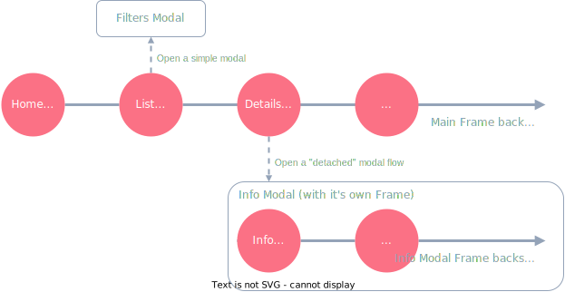

When it comes to navigation, there are two primary types of navigation, regular navigation using [Frame](/ui/frame) & [Page](/ui/frame), and navigation using modals. The key difference is the handling of the backstack and the back button&mdash;modals allow navigating the user through a "detached" flow, while Frames & Pages usually keep track of the backstack. It's important to note that modals can have their own Frame & Page backstack too, allowing for great flexibility when designing the navigation of your app.

- [Navigation using Frames and Pages](/guide/navigation/frames-and-pages)
- [Navigation using Modals](/guide/navigation/modals)

## Example user flow

For example, let's assume we have a **Home Page**, from which the user can navigate to a **List Page**. On the **List Page** the user is able to tweak some filters, we can show these in a modal to not disrupt the backstack/back button flow. When the user taps on a list item, we navigate to a **Details Page**. On the **Details Page** the user can view an additional **Info Page** in the **Info Modal** and navigate around further without disrupting the main backstack, once the **Info Modal** is closed, the user can continue navigating forwards and back in the **Main Frame**.

