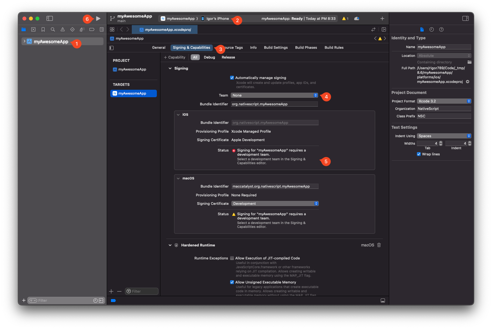

To run a NativeScript app, you need a device &mdash; either a physical or virtual.

## Running a project

To run a project, use the `ns run` command. There's also a `ns debug` command covered in the [debugging documentation](/guide/debugging#debugging-with-chrome-devtools).

```cli
ns run android
ns run ios
```

The `run` command runs the app on all connected devices matching the platform. You can control which devices to run on with the following flags:

#### --simulator, --emulator

These flags are identical. Using them runs the project only on virtual devices.

#### --device &lt;id&gt;

Only run on the specified device. The id is taken from the output of `ns devices`.

## Running on physical devices

You can develop on physical devices in a couple ways:

- Through **USB** by [enabling USB Debugging on Android Devices](#enable-usb-debugging-on-android-devices) or [preparing an iOS device for development](#preparing-an-ios-device-for-development)
- **Wirelessly** by following these guides:
  - [Connect to a device over Wi-Fi (Android 11+)](https://developer.android.com/studio/command-line/adb#connect-to-a-device-over-wi-fi-android-11+)
  - [Connect to a device over Wi-Fi (Android 10 and lower)](https://developer.android.com/studio/command-line/adb#wireless).
  - [Connect to a device over Wi-Fi via Xcode](#connecting-an-ios-device-over-wi-fi)

### Enable USB Debugging on Android devices

#### 1. Activate the `Developer options` menu and enable USB debugging

Go to `Settings › About phone › Software info` and then tap `Build number` at least 7 times until a message pops up saying "You are now a developer".

Next, go to `Settings › System › Developer options` and enable `USB debugging`.

#### 2. Plug in your device via USB and verify it's detected

Plug in your device via USB and check that it is correctly being detected by <abbr title="Android Debug Bridge">ADB</abbr>:

```cli
adb devices
```

To verify NativeScript can also detect the device, run:

```cli
ns devices android
```

Your device should appear in both lists.

::: warning Troubleshooting

If any of the above failed, we recommend checking out the [Android ADB documentation](https://developer.android.com/studio/command-line/adb), or asking in [our Community Discord](https://nativescript.org/discord) for assistance.

:::

### Preparing an iOS device for development

Before the NativeScript cli can run apps on a physical iOS device, the device must be set up and registered.

Use a USB cable to connect the device. Navigate to the `platforms/ios` folder in your project, then open the `.xcworkspace` file in Xcode.

:::warning Note

If the `platforms/ios` folder doesn't exist, run `ns prepare` to scaffold it.

If there's no `.xcworkspace` file, you can open the `.xcodeproj` file instead.

:::



<StepList>

1. Select the app target from the sidebar
2. Select the target device
3. Go to `Signing & Capabilities`
4. Select a team (Create an [Apple developer account](https://developer.apple.com/) if you don't have one yet)
5. If this is your first time running an app on your iOS device, you may need to register your device for development by clicking the `Register Device` button that shows up here
6. To verify you are able to run on the device, run the app once from within Xcode

</StepList>

Once the app successfully runs from Xcode, you can close it and continue using the NativeScript cli:

```cli
ns run ios
```

The app should install and launch on the connected iOS device.

### Connecting an iOS device over Wi-Fi

Once the device has been [prepared for development](#preparing-an-ios-device-for-development), keep the device plugged in, open Xcode **Window › Devices and Simulators**, select your device from the left sidebar and tick the **Connect via network** checkbox.

After disconnecting the cable, the device should still show up in `ns devices` and running the app should work as normal:

```cli
ns run ios
```

The app should install and launch on the iOS device.

::: warning Note
Xcode network devices sometimes get disconnected or have an unreliable connection. We recommend using a wired connection to avoid these occasional issues.
:::

## Running on virtual devices

### Android Emulators

#### Creating Android Virtual Device via Android Studio

Open Android Studio, and then open **AVD Manager** from the **Tools › AVD Manager** menu (_Configure › AVD Manager_ dropdown on the Welcome Screen).

1. Click **Create Virtual Device...**
2. Pick a device from the list, for example **Pixel 3 XL**
3. Click **Next**, then select a system image. For most users we recommend picking the latest **API Level** from the **Recommended** tab (press download if the selection is greyed out).
4. Click **Next** and leave everyting on default (feel free to customize/experiment with different settings).
5. Click **Finish** to create the AVD, which should now show up in the **AVD Manager** list.

To start the newly created AVD, press the green play button next to it.

#### Creating Android Virtual Device via command line

You can use `avdmanager` to create Android virtual devices. To get started, read the [official Android documenation about using `avdmanager`](https://developer.android.com/tools/avdmanager).

### Third-party Android Emulators

NativeScript works with most third-party Android emulators like [GenyMotion](https://www.genymotion.com). For usage instructions, please refer to their documentation.

### iOS Simulators

#### Creating iOS Simulators

To create additional iOS simulators, follow the [official Apple documentation about adding additional Simulators](https://developer.apple.com/documentation/safari-developer-tools/adding-additional-simulators)

#### Running on iOS Simualators

Running `ns run ios` will launch the default Simulator (if there are no physical devices, or already running Simulators available). To switch to a different Simulator, go to **File › Open Simulator** and select a Simulator to run.
