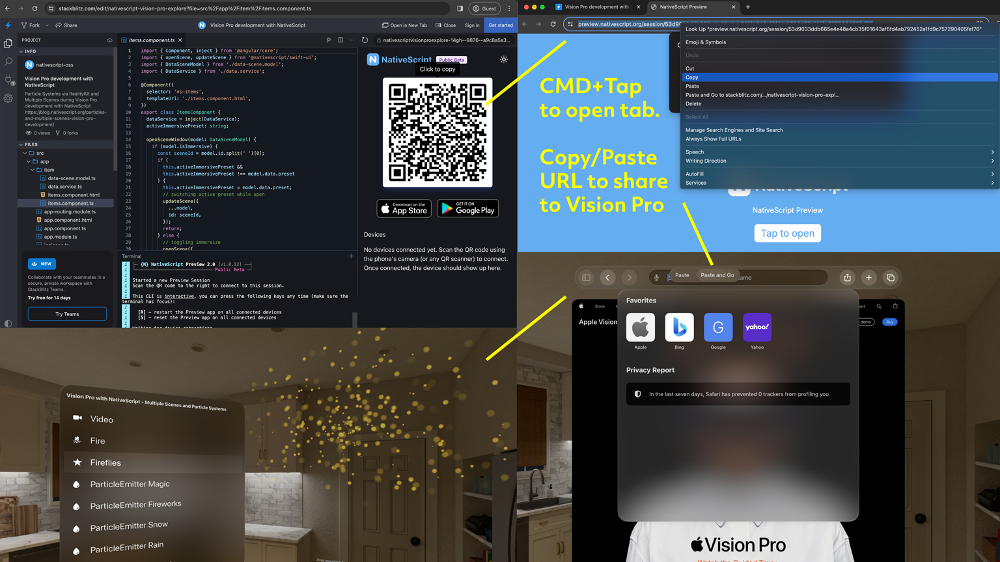

Just like you can Preview iOS and Android apps using StackBlitz with [NativeScript Preview](https://preview.nativescript.org/), you can do the same with visionOS apps.

## Using NativeScript Preview with Vision Pro

*This is useful if you have a physical Vision Pro device.*

1. On your Vision Pro
   - Search for and install "NativeScript Preview" on the App Store.
2. On your desktop
   1. Start a StackBlitz session containing a Vision Pro app like this one: https://stackblitz.com/edit/nativescript-vision-pro-explore?file=src%2Fapp%2Fitem%2Fitems.component.ts
      - *Tip: You can also share your desktop to your Vision Pro to copy/paste links directly.*
   2. Once QR Code appears on the right side, you can CMD+Tap on the QR to open a new browser tab. 
   3. Copy/Paste the URL from the new browser tab
   4. Share this URL with your Vision Pro
3. Back on your Vision Pro
   1. Tapping on the shared link will open NativeScript Preview and begin building in the StackBlitz terminal.
   2. Once the build is complete, Vision Pro Safari will launch with a prompt to open 'Preview' on the Vision Pro to begin a live development session with your Vision Pro app. 
