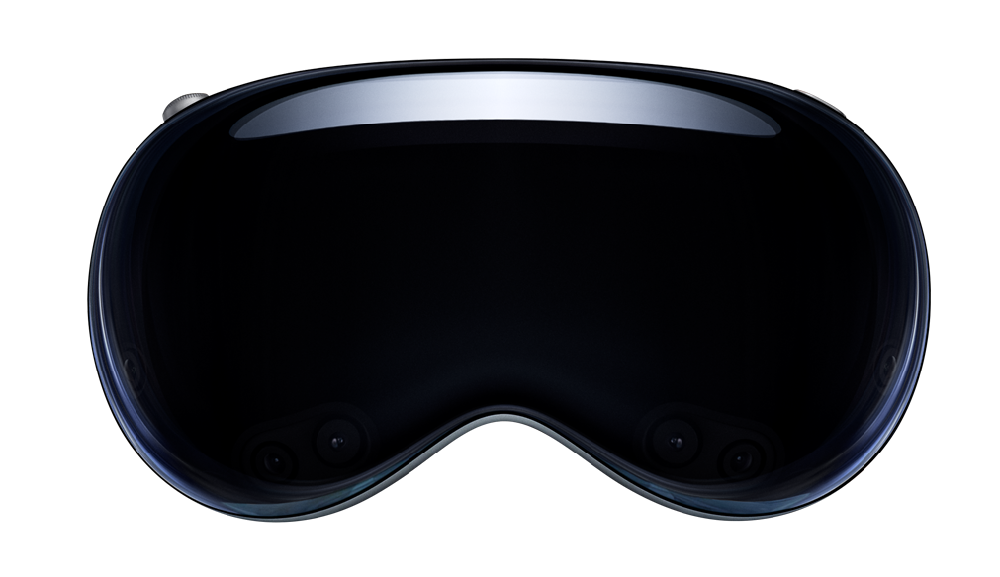

Apple provides [visionOS](https://developer.apple.com/visionos/) for development through the latest [Xcode 15 beta](https://developer.apple.com/xcode/resources/).

::: info Note
You will need an [Apple developer account](https://developer.apple.com/programs/enroll/) to download beta tools and SDKs.
:::

<iframe style="width: 100%; min-height: 200px; aspect-ratio: 16 / 9;" src="https://www.youtube.com/embed/1NGoY74-vZc" title="Developing for visionOS with NativeScript" frameborder="0" allow="accelerometer; autoplay; clipboard-write; encrypted-media; gyroscope; picture-in-picture; web-share" allowfullscreen></iframe>

## Create a visionOS project

Given that Apple is distributing visionOS with _only_ [Xcode beta](https://developer.apple.com/xcode/resources) at the moment (_not the current Xcode release_), we are providing `vision` tagged npm packages to keep things distinct while you develop for visionOS.

**You will need the `vision` CLI**:

```bash
npm install -g nativescript@vision
```

::: info Note
This tagged CLI is backwards compatible so you can use it for standard iOS and Android projects as well.
:::

You can now use the `--vision` (or `--visionos`) flags when creating your app.

```bash
ns create myapp --vision
```

This will setup a preconfigured visionOS ready app using a plain TypeScript base.

If you prefer a flavor, you can use any of the following:

- [Angular](https://angular.io/): `ns create myapp --vision-ng`
- [React](https://react.dev/): `ns create myapp --vision-react`
- [Solid](https://www.solidjs.com/): `ns create myapp --vision-solid`
- [Svelte](https://svelte.dev/): `ns create myapp --vision-svelte`
- [Vue (3.x)](https://vuejs.org/): `ns create myapp --vision-vue`

All projects are preconfigured with [tailwindcss](https://tailwindcss.com).

### What makes a project work on visionOS?

Primarily 3 key elements make up a NativeScript driven visionOS project:

1. `App_Resources/visionOS/src/NativeScriptApp.swift`
2. `App_Resources/visionOS/build.xcconfig` with a minimum target of `IPHONEOS_DEPLOYMENT_TARGET = 17.0`
3. The following dependencies are used:

```json
{
  "dependencies": {
    "@nativescript/core": "vision"
  },
  "devDependencies": {
    "@nativescript/visionos": "~8.6.0",
    "@nativescript/webpack": "vision"
  }
}
```

::: info Note
Once Apple releases visionOS in a final Xcode release these tags will no longer be necessary.
:::

## Design Guidelines and Notes

We strongly encourage developers to understand and use Apple's system glass materials throughout their apps in addition to closely following their design guidelines.

We recommend watching the following WWDC 2023 videos covering visionOS for fundamental understandings:

- [Design for spatial user interfaces](https://developer.apple.com/videos/play/wwdc2023/10076/)
- [Design considerations for vision and motion](https://developer.apple.com/videos/play/wwdc2023/10078/)
- [Meet UIKit for spatial computing](https://developer.apple.com/videos/play/wwdc2023/111215/)
- [Create accessible spatial experiences](https://developer.apple.com/videos/play/wwdc2023/10034/)
- [Explore immersive sound design](https://developer.apple.com/videos/play/wwdc2023/10271/)
- [Deliver video content for spatial experiences](https://developer.apple.com/videos/play/wwdc2023/10071/)
- [Create a great spatial playback experience](https://developer.apple.com/videos/play/wwdc2023/10070/)

You may by interested in more [here](https://developer.apple.com/videos/wwdc2023/).

### CSS Adjustments for visionOS

You will likely want to make your Pages transparent to allow the natural glass materials to come through by using this CSS specifier:

```css
.ns-visionos Page {
  background-color: transparent;
}
```

When running your app on `visionOS`, you can scope CSS selectors where needed by the root level `.ns-visionos` class.

### Hover effect for visionOS materials

All standard/system UI Component usages like Button, Switch, Pickers, etc. will automatically get system hover style effects on visionOS.

It's common to add `tap` bindings in NativeScript to things like StackLayout, GridLayout, etc. which are just [UIView](https://developer.apple.com/documentation/uikit/uiview)'s.

You can use new @nativescript/core APIs to easily enable visionOS [hover styles](https://developer.apple.com/documentation/uikit/uihoverstyle) on any view type throughout your app or customize per view.

Apple discusses some of the important spatial considerations with these effects in [this session](https://developer.apple.com/videos/play/wwdc2023/111215/).

Each view can specify it's own custom `hoverStyle` as follows:

```xml
<GridLayout hoverStyle="{{customHoverStyle}}" tap="{{tapAction}}"/>
```

The `hoverStyle` property can be defined as a `string` or `VisionHoverOptions`.

```ts
import { VisionHoverOptions } from '@nativescript/core'

const hoverStyle: VisionHoverOptions = {
  effect: 'highlight',
  shape: 'rect',
  shapeCornerRadius: 16,
}
```

This would apply a visionOS system highlight rectangle with a cornerRadius of 16 to that `GridLayout` when a hover is detected.

The options are as follows:

```ts
export type VisionHoverEffect = 'automatic' | 'highlight' | 'lift'
export type VisionHoverShape = 'circle' | 'rect'
export type VisionHoverOptions = {
  effect: VisionHoverEffect
  shape?: VisionHoverShape
  shapeCornerRadius?: number
}
```

When a `string` is provided, it will look for predefined `hoverStyle`'s within the `TouchManager.visionHoverOptions` that match the string name. This allows you to predefine and share custom hoverStyle's across your entire app.

You can enable these effects globally throughout your app for any view which has a `tap` binding by enabling:

```ts
TouchManager.enableGlobalHoverWhereTap = true
```

This allows you to predefine any number of custom `hoverStyle`'s you'd like to use throughout your app. You could do so in the `app.ts` or `main.ts` (aka, bootstrap file), for example:

```ts
TouchManager.enableGlobalHoverWhereTap = true
TouchManager.visionHoverOptions = {
  default: {
    effect: 'highlight',
    shape: 'rect',
    shapeCornerRadius: 16,
  },
  slimBox: {
    effect: 'lift',
    shape: 'rect',
    shapeCornerRadius: 8,
  },
  round: {
    effect: 'lift',
    shape: 'circle',
  },
}
```

You could then apply custom `hoverStyle`'s by their name anywhere in your app:

```xml
<GridLayout hoverStyle="default" tap="tapAction"/>
<GridLayout hoverStyle="slimBox" tap="tapAction"/>
<GridLayout hoverStyle="round" tap="tapAction"/>
```

You can also disable a hoverStyle on any view by adding the `visionIgnoreHoverStyle` property if desired.

::: info Note
When no `hoverStyle` is defined and not using `TouchManager.enableGlobalHoverWhereTap`, visionOS will use default behavior by enabling hoverStyle's on standard controls as mentioned. Other views would have no hoverStyle as expected.
:::

### View template visionOS scoping

You can also scope sections of your view templates specifically for visionOS layouts as needed:

```xml
<visionos>
    <Label>I only show on visionOS</Label>
</visionos>
<ios>
    <Label>I only show on iOS</Label>
</ios>
<android>
    <Label>I only show on Android</Label>
</android>
```

::: info Note
You should not have to do a lot of this throughout apps in general but these options are available to you where desired.
:::

## NativeScript and the SwiftUI App Lifecycle

NativeScript 8.6 brings support for the [SwiftUI App](https://developer.apple.com/documentation/swiftui/app) Lifecycle for the first time. For a better understanding of the SwiftUI App Lifecycle, we recommend the following articles:

- https://peterfriese.dev/posts/ultimate-guide-to-swiftui2-application-lifecycle/
- https://dev.to/sam_programiz/swiftui-app-life-cycle-2n68

> how can we tell the compiler about the entry point to our application?

Historically with NativeScript apps, we would use the [Objective C main entry](https://github.com/NativeScript/ios/blob/d67588cb3866212ccd86b105edf1207fddde2db9/project-template/internal/main.m#L19) to define the entry point where the NativeScript engine was intialized and your app would be booted.

We now also support a SwiftUI `@main` entry via a single `App_Resources/visionOS/src/NativeScriptApp.swift` file:

```swift
import SwiftUI

@main
struct NativeScriptApp: App {

    var body: some Scene {
        NativeScriptMainWindow()
    }
}
```

The `NativeScriptMainWindow` is a SwiftUI [WindowGroup](https://developer.apple.com/documentation/swiftui/windowgroup) which returns a Scene, your NativeScript app. In visionOS apps, you can expand this `struct` to support new [Scenes](https://developer.apple.com/documentation/swiftui/scene) and [Spaces](https://developer.apple.com/documentation/visionos/presenting-windows-and-spaces) with new and exciting window styles like [volumetric](https://developer.apple.com/documentation/swiftui/windowstyle/volumetric/) as well as [Immersive Spaces](https://developer.apple.com/documentation/visionos/creating-fully-immersive-experiences).

`NativeScriptMainWindow` is a SwiftUI struct representing a Scene itself which looks like this:

```swift
struct NativeScriptMainWindow: Scene {
    var body: some Scene {
        WindowGroup {
            NativeScriptAppView(found: { windowScene in
                NativeScriptEmbedder.sharedInstance().setWindowScene(windowScene)
            }).onAppear {
                // Your app is booted here!
                DispatchQueue.main.async {
                    NativeScriptStart.boot()
                }
            }
        }
        .windowStyle(.plain)
    }

    init() {
        // NativeScript engine is configured here!
        NativeScriptEmbedder.sharedInstance().setDelegate(NativeScriptViewRegistry.shared)
        NativeScriptStart.setup()
    }
}
```

::: info Note
This is enabled for `visionOS` only right now with NativeScript however this will be used in iOS and macOS apps in the future.
:::

### Support multiple windows

In order to add volumetric and immersize spaces, be sure you add the following setting to your `App_Resources/visionOS/Info.plist`:

```xml
<key>UIApplicationSceneManifest</key>
<dict>
    <key>UIApplicationSupportsMultipleScenes</key>
    <true/>
</dict>
```

## What's Next?

Beyond what is already possible, the innovative possibility is incredible and this is the beginning of an entirely new world. @nativescript/core along with 3rd party plugins could provide even more SwiftUI providers to enable exciting and powerful development workflows.

We will begin sharing more details over time about expanding your visionOS apps to support volumetric windows and immersive spaces while you explore what's already possible.

You can follow along in these "Vision Pro 🥽 Hello World" tutorials:

- [Develop Vision Pro 🥽 apps with TypeScript](https://blog.nativescript.org/develop-visionos-apps-with-typescript)
- [Develop Vision Pro 🥽 apps with Angular](https://blog.nativescript.org/develop-visionos-apps-with-angular)
- [Develop Vision Pro 🥽 apps with React](https://blog.nativescript.org/develop-visionos-apps-with-react)
- [Develop Vision Pro 🥽 apps with Solid](https://blog.nativescript.org/develop-visionos-apps-with-solid)
- [Develop Vision Pro 🥽 apps with Svelte](https://blog.nativescript.org/develop-visionos-apps-with-svelte)
- [Develop Vision Pro 🥽 apps with Vue](https://blog.nativescript.org/develop-visionos-apps-with-vue)
