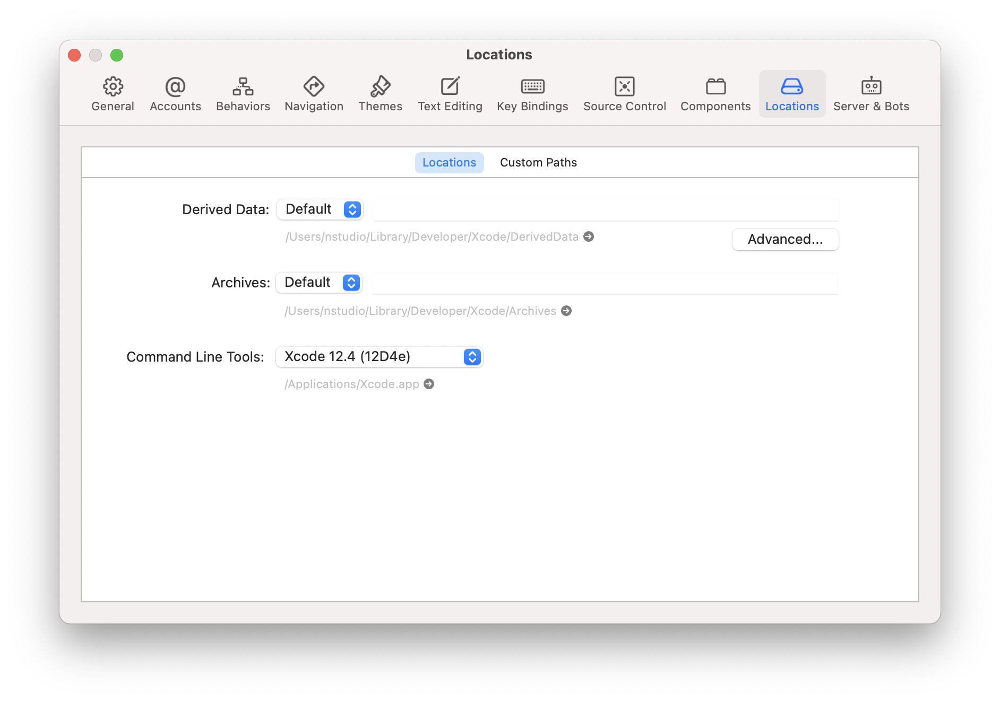

## Setting up macOS for Android

You will need Node, NativeScript CLI (command line interface), Android Studio and a JDK (java development kit).

**Android Studio** is not strictly necessary &mdash; however it provides an easy-to-use interface for installing and managing the Android SDKs.

We recommend using [Homebrew](https://brew.sh/) to install the required dependencies &mdash; a popular package manager for macOS.

:::warning
When installing Homebrew, carefully follow their instructions to avoid configuration issues.
:::

Complete the Homebrew installation process **before proceeding further**.

Setting up the Android development environment can be daunting if you are new to Android development, however following the next steps carefully will get you up and running in no time.

### Installing Node

To install **Node** we recommend using a node version manager, such as [nvm](https://github.com/nvm-sh/nvm), [n](https://npmjs.com/n) or any other node version manager you prefer. In these docs we will be using **nvm**, but feel free to use a different node version manager.

1. Follow the [install instructions in the nvm repository](https://github.com/nvm-sh/nvm#installing-and-updating).
2. Once the installation is complete, open a new Terminal and verify you can run `nvm ls`.
3. Install the latest Node release with:
   ```cli
   nvm install node
   ```
4. Verify the installation was successful and run
   ```cli
   node -v
   npm -v
   ```

### Installing a JDK

To install a **JDK** (using the prebuilt OpenJDK binaries from [Adoptium](https://adoptium.net/)) run the following command:

```cli
brew tap homebrew/cask-versions
brew install --cask temurin@17
```

Once installed, open a new Terminal and verify that the default version is the one we installed:

```cli
javac --version
# should print something like:
# javac 17.x.x
```

If the version looks correct, you are ready to move on to [Installing Android Studio](#installing-android-studio), otherwise you will need to set the `JAVA_HOME` environment variable.

Add the following lines to your shell profile, usually `~/.zshrc`, `~/.bash_profile` or `~/.bashrc` or `~/.zprofile` config file:

```shell
export JAVA_HOME=$(/usr/libexec/java_home -v"17");
```

Repeat the verification from above.

### Installing Android Studio

[Download and install Android Studio](https://developer.android.com/studio). In the installation wizard, make sure you have the following components selected (the list should appear if you select **custom** options):

- Android SDK
- Android SDK Platform
- Android Virtual Device
- Performance (Intel ® HAXM) &mdash; optional, learn more about [AMD Processor & Hyper-V support](https://android-developers.googleblog.com/2018/07/android-emulator-amd-processor-hyper-v.html)

The setup may take a while, but once it has finished a welcome screen should appear.

Android Studio installs the latest Android SDK by default, which in most cases should be all that's needed to build a NativeScript app.

### Configuring `ANDROID_HOME` and `PATH`

Configure the `ANDROID_HOME` environment variable for NativeScript to be able to find the Android SDK, and add the required tools to path.

Add the following lines to your shell profile, usually `~/.bash_profile` or `~/.bashrc`, or if you are using `zsh` then `~/.zprofile` or `~/.zshrc` config file:

```shell
export ANDROID_HOME=$HOME/Library/Android/sdk
export PATH=$PATH:$ANDROID_HOME/platform-tools
```

### Installing the NativeScript CLI

Install the **NativeScript CLI** globally:

```cli
npm install -g nativescript
```

<!-- @include: ../parts/nativescript-cli-deprecation-warnings.md -->

### Verifying the environment

To verify that the installation was successful, open a new Command Prompt window (to ensure the new environment variables are loaded) and run:

```cli
ns doctor android
```

If you see **No issues were detected** then you have successfully set up your system.

::: warning Troubleshooting

If any of the above failed, we recommend asking in [our Community Discord](https://nativescript.org/discord) for assistance.

:::

## Setting up macOS for iOS

You will need Node, NativeScript CLI (command line interface), XCode, xcodeproj, cocoapods.

We recommend using [Homebrew](https://brew.sh/) to install the required dependencies &mdash; a popular package manager for macOS.

:::warning Note
When installing Homebrew, carefully follow their instructions to avoid configuration issues.
:::

### Installing Node

To install **Node** we recommend using a node version manager, such as [nvm](https://github.com/nvm-sh/nvm), [n](https://npmjs.com/n) or any other node version manager you prefer. In these docs we will be using **nvm**, but feel free to use a different node version manager.

1. Follow the [install instructions in the nvm repository](https://github.com/nvm-sh/nvm#installing-and-updating).
2. Once the installation is complete, open a new Terminal and verify you can run `nvm ls`.
3. Install the latest Node release with:
   ```cli
   nvm install node
   ```
4. Verify the installation was successful and run
   ```cli
   node -v
   npm -v
   ```

### Installing XCode

Next you will need **XCode**. XCode will install on macOS 10.15.7 Catalina or later. It will need about 50G Disk space for installation.
Open the **AppStore**, search for **XCode** and and install it.

Once the installation is complete (this may take a while &mdash; brew a coffee and enjoy a little break), open **XCode** and if it prompts you to install the Command-Line-Tools make sure to say **Yes**.

Open `XCode › Preferences › Locations` and make sure **Command Line Tools** is set



### Installing Ruby

Install **ruby 2.7** and link it so it's available in your shell environment:

```cli
brew install ruby@2.7
brew link ruby@2.7
```

Add the following lines to your shell profile, usually `~/.bash_profile` or `~/.bashrc`, or if you are using `zsh` then `~/.zshrc` config file:

```shell
# Add rubygems to the path
export PATH=/opt/homebrew/lib/ruby/gems/2.7.0/bin:$PATH
# or
export PATH=/usr/local/lib/ruby/gems/2.7.0/bin:$PATH
```

:::warning Important
Make sure to open a new terminal window for the changes to take effect!
:::

### Installing `cocoapods` and `xcodeproj`

In a new terminal window, install the **<abbr title="A package manager for managing 3rd party native dependencies">cocoapods</abbr>** and **<abbr title="CLI utility to interact with XCode projects">xcodeproj</abbr>** gems by running the following commands:

<!-- Note: xcodeproj seems to be installed when installing cocoapods via brew -->
<!-- brew install cocoapods # this will install both cocoapods and xcodeproj -->
<!-- gem install ... # requires root privileges on macOS. sudo works. -->

```cli
sudo gem install cocoapods
sudo gem install xcodeproj
```

Depending on installation methods, the location of ruby gems may vary. Make sure you have the right folder in your `$PATH` by running `which pod`.
If the binary is not found run `gem env` to examine your folders, and update your `$PATH` in the login profile file.

### Installing Python and `six`

Install python3 from Homebrew:

```cli
brew install python

# verify installation
python3 --version
```

Next, update **<abbr title="Python package manager">pip</abbr>** and install **<abbr title="Python 2 & 3 compatibility package used by NativeScript">six</abbr>** by running the following:

```cli
python3 -m pip install --upgrade pip
python3 -m pip install six
```

<!--
::: warning Note

macOS ships with Python pre-installed, however starting with **macos 12.3** there's no longer a `python` executable, and aliasing to the system `python3` causes an issue where it prompts to "_Install command-line tools_" whenever invoked through the alias. To work around this issue, we recommend installing Python from Homebrew instead.

:::

Install python3 from Homebrew, then alias it as `python`:

```cli
brew install python

# create /usr/local/bin directory if it doesn’t exist
sudo mkdir -p /usr/local/bin

# create alias: python -> /opt/homebrew/bin/python3
sudo ln -s -f /opt/homebrew/bin/python3 /usr/local/bin/python

# verify the alias and python version
python --version
# should print
# Python 3.x.x
```

Next, update **<abbr title="Python package manager">pip</abbr>** and install **<abbr title="Python 2 & 3 compatibility package used by NativeScript">six</abbr>** by running the following:

```cli
python -m pip install --upgrade pip
python -m pip install six
```
-->

### Installing the NativeScript CLI

Install the **NativeScript CLI** globally:

```cli
npm install -g nativescript
```

<!-- @include: ../parts/nativescript-cli-deprecation-warnings.md -->

### Verifying the environment

To verify that the installation was successful, open a new Terminal window (to ensure the new environment variables are loaded) and run:

```cli
ns doctor ios
```

If you see **No issues were detected** then you have successfully set up your system.

::: warning Troubleshooting

If any of the above failed, we recommend asking in [our Community Discord](https://nativescript.org/discord) for assistance.

:::
