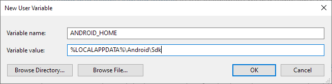

## Setting up Windows for Android

You will need Node, a JDK (java development kit), Android Studio and the NativeScript CLI (command line interface).

**Android Studio** is not strictly necessary &mdash; however it provides an easy-to-use interface for installing and managing the Android SDKs.

We recommend using [Chocolatey](https://chocolatey.org/) to install the required dependencies &mdash; a popular package manager for Windows.

Setting up the Android development environment can be daunting if you are new to Android development, however following the next steps carefully will get you up and running in no time.

### Installing Node

To install **Node** we recommend using a node version manager, such as [nvm-windows](https://github.com/coreybutler/nvm-windows), [nvs](https://github.com/jasongin/nvs) or any other node version manager you prefer. In these docs we will be using **nvm-windows**, but feel free to use a different node version manager.

1. Follow the [install instructions in the nvm-windows repository](https://github.com/coreybutler/nvm-windows#installation--upgrades). We recommend using the installer, however if you have a more advanced understanding of your needs you may also go for the manual installation instead.
2. Run and follow the `nvm-setup.exe` instructions.
3. Once the installation is complete, open a new Command Prompt and verify you can run `nvm ls`.
4. Install the latest Node release with:
   ```cli
   nvm install latest
   ```
5. Verify the installation was successful and run
   ```cli
   node -v
   npm -v
   ```

::: warning Troubleshooting

If any of the above failed, we recommend checking out the [Microsoft Docs for Setting up Node](https://learn.microsoft.com/en-us/windows/dev-environment/javascript/nodejs-on-windows), or asking in [our Community Discord](https://nativescript.org/discord) for assistance.

:::

<!-- TODO: verify steps on a Windows machine! -->

### Installing a JDK

To install a **JDK** (using the prebuilt OpenJDK binaries from [Adoptium](https://adoptium.net/)) open an Administrator Command Prompt (right click and select "Run as Administrator") and run the following command:

```cli
choco install -y temurin11
```

Once installed, you might need to add it to your `Path`. First, check if you need to add it to your `Path` by opening a new Command Prompt and running the following:

```cli
javac --version
```

If you see a version number printed, you are ready to move on to [Installing Android Studio](#installing-android-studio), otherwise you will need to add the JDK binaries to your system environment `Path`:

1. Search for "**Edit the system environment variables**" in Windows Search and select
2. Click on "**Environment variables...**" in the bottom corner
3. Under the "**User variables for...**" select the **Path** variable and click **Edit...**
4. Click **New** and add the **JDK binaries folder** path to the list.
   The default location is
   ```
   %LOCALAPPDATA%\???
   ```

### Installing Android Studio

[Download and install Android Studio](https://developer.android.com/studio). In the installation wizard make sure you have the following components selected (the list should appear if you select **custom** options):

- Android SDK
- Android SDK Platform
- Android Virtual Device
- Performance (Intel ® HAXM) &mdash; optional, learn more about [AMD Processor & Hyper-V support](https://android-developers.googleblog.com/2018/07/android-emulator-amd-processor-hyper-v.html)

The setup may take a while, but once it has finished a welcome screen should appear.

Android Studio installs the latest Android SDK by default, which in most cases should be all that's needed to build a NativeScript app.

### Configuring `ANDROID_HOME` and `PATH`

Configure the `ANDROID_HOME` environment variable for NativeScript to be able to find the Android SDK.

1. Search for "**Edit the system environment variables**" in Windows Search and select
2. Click on "**Environment variables...**" in the bottom corner
3. Under the "**User variables for...**" click on **New...** to create the `ANDROID_HOME` user variable that points to the path of the Android SDK:



The SDK is by default located at:

```
%LOCALAPPDATA%\Android\Sdk
```

To find the actual location in the Android Studio **Settings**, navigate to **Appearance & Behavior › System Settings › Android SDK** and copy the Android SDK Location.

Next, add Android **platform-tools** to path:

1. Search for "**Edit the system environment variables**" in Windows Search and select
2. Click on "**Environment variables...**" in the bottom corner
3. Under the "**User variables for...**" select the **Path** variable and click **Edit...**
4. Click **New** and add the **platform-tools** path to the list.
   The default location is inside the Android SDK's `platform-tools` folder:
   ```
   %LOCALAPPDATA%\Android\Sdk\platform-tools
   ```

### Installing the NativeScript CLI

Install the NativeScript CLI globally:

```cli
npm install -g nativescript
```

<!-- @include: ../parts/nativescript-cli-deprecation-warnings.md -->

### Verifying the environment

To verify that the installation was successful, open a new Command Prompt window (to ensure the new environment variables are loaded) and run:

```cli
ns doctor android
```

If you see **No issues were detected** then you have successfully set up your system.

Lastly, you will also want to [set up an android device or emulator](#setting-up-an-android-device-or-emulator).

::: warning Troubleshooting

If any of the above failed, we recommend asking in [our Community Discord](https://nativescript.org/discord) for assistance.

:::

## Setting up Windows for iOS

:::danger :x: Unsupported

A Mac is required to build projects that use native iOS code. Simpler apps can be tested using [NativeScript Preview](https://preview.nativescript.org).

:::
