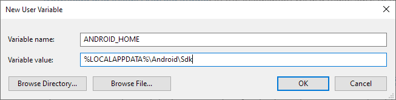

## Setting up Windows for Android

You will need Node, a JDK (java development kit), Android Studio and the NativeScript CLI (command line interface).

**Android Studio** is not strictly necessary &mdash; however it provides an easy-to-use interface for installing and managing the Android SDKs.

We recommend using [Chocolatey](https://chocolatey.org/) to install the required dependencies &mdash; a popular package manager for Windows.

Setting up the Android development environment can be daunting if you are new to Android development, however following the next steps carefully will get you up and running in no time.

### Installing Node

To install **Node** we recommend using a node version manager, such as [nvm-windows](https://github.com/coreybutler/nvm-windows), [nvs](https://github.com/jasongin/nvs) or any other node version manager you prefer. In these docs we will be using [nvm-windows](https://github.com/coreybutler/nvm-windows), but feel free to use a different node version manager.

1. Install [nvm-windows](https://github.com/coreybutler/nvm-windows) using one of the following methods:
   ::: code-group
   
   ```bash [Chocolatey]
   choco install -y nvm
   ```
   
   ```text [Installer Instructions]
   https://github.com/coreybutler/nvm-windows#installation--upgrades
   ```
   
   :::
2. After installation, open a new Command Prompt and verify:
   ```bash
   nvm version
   ```
3. Once the installation is complete, open a new Command Prompt and verify you can run `nvm ls`.
4. Install the latest Node release with:
   ```bash
   nvm install node
   ```
5. Verify the installation was successful and run
   ```bash
   node -v
   npm -v
   ```

::: warning Troubleshooting

If any of the above failed, we recommend checking out the [Microsoft Docs for Setting up Node](https://learn.microsoft.com/en-us/windows/dev-environment/javascript/nodejs-on-windows), or asking in [our Community Discord](https://nativescript.org/discord) for assistance.

:::

<!-- TODO: verify steps on a Windows machine! -->

### Installing a JDK

To install a **JDK** (using the prebuilt OpenJDK binaries from [Adoptium](https://adoptium.net/)) open an Administrator Command Prompt (right click and select "Run as Administrator") and run the following command:

```bash
choco install -y temurin21
```

Once installed, you might need to add it to your `Path`. First, check if you need to add it to your `Path` by opening a new Command Prompt and running the following:

```bash
javac --version
```

If you see a version number printed, you may skip this step. Otherwise, you will need to add the JDK binaries to your system environment `Path`:

1. Search for "**Edit the system environment variables**" in Windows Search and select
2. Click on "**Environment variables...**" in the bottom corner
3. Under the "**User variables for...**" select the **Path** variable and click **Edit...**
4. Click **New** and add the **JDK `bin` folder path** to the list.
   The **JDK** location may vary depending on the version you have installed.
   ```
   C:\Program Files\Eclipse Adoptium\jdk-21.0.9.10\bin
   ```

Additionally, some installations may require creating the `JAVA_HOME` environment variable manually:

1. Search for "**Edit the system environment variables**" in Windows Search and select
2. Click on "**Environment variables...**" in the bottom corner
3. Click on **New...** under the "**User variables for...**" section
4. Add the following variable. Ensure you're using the correct JDK path, without the \bin suffix. Example:
   ```
   VARIABLE_NAME: JAVA_HOME
   VARIABLE_VALUE: C:\Program Files\Eclipse Adoptium\jdk-21.0.9.10-hotspot
   ```

You may need to restart your terminal for changes to apply.

### Installing Android Studio

[Download and install Android Studio](https://developer.android.com/studio). In the installation wizard make sure you have the following components selected (the list should appear if you select **custom** options):

- Android SDK
- Android SDK Build-Tools
- Android SDK Platform
- Android Virtual Device
- Performance (Intel ® HAXM) &mdash; optional, learn more about [AMD Processor & Hyper-V support](https://android-developers.googleblog.com/2018/07/android-emulator-amd-processor-hyper-v.html)

The setup may take a while, but once it has finished a welcome screen should appear.

Android Studio installs the latest Android SDK by default, which in most cases should be all that's needed to build a NativeScript app.

After Android Studio finishes installing, open **Settings > Languages & Frameworks > Android SDK** and confirm the SDK path shown there matches the path you will use for `ANDROID_HOME`.

Then verify the following components are installed:

- Under **SDK Platforms**: at least one recent Android SDK Platform
- Under **SDK Tools**: **Android SDK Build-Tools** and **Android SDK Platform-Tools**

If `ns doctor android` later reports that no compatible Android SDK Build-Tools are installed, return to this screen and install a recent Build-Tools version.

### Configuring `ANDROID_HOME` and `PATH`

Configure the `ANDROID_HOME` environment variable for NativeScript to be able to find the Android SDK.

1. Search for "**Edit the system environment variables**" in Windows Search and select
2. Click on "**Environment variables...**" in the bottom corner
3. Under the "**User variables for...**" click on **New...** to create the `ANDROID_HOME` user variable that points to the path of the Android SDK:



The SDK is by default located at:

```
%LOCALAPPDATA%\Android\Sdk
```

To find the actual location in the Android Studio **Settings**, navigate to **Languages & Frameworks › Android SDK** and copy the Android SDK Location.

Next, add Android **platform-tools** to path:

1. Search for "**Edit the system environment variables**" in Windows Search and select
2. Click on "**Environment variables...**" in the bottom corner
3. Under the "**User variables for...**" select the **Path** variable and click **Edit...**
4. Click **New** and add the **platform-tools** path to the list.
   The default location is inside the Android SDK's `platform-tools` folder:
   ```
   %LOCALAPPDATA%\Android\Sdk\platform-tools
   ```

### Installing the NativeScript CLI

Install the NativeScript CLI globally:

```bash
npm install -g nativescript
```

<!-- @include: ../parts/nativescript-cli-deprecation-warnings.md -->

### Verifying the environment

To verify that the installation was successful, open a new Command Prompt window (to ensure the new environment variables are loaded) and run:

```bash
ns doctor android
```

If you see **No issues were detected** then you have successfully set up your system.

If not, verify the values NativeScript will resolve from your shell:

```bat
echo %JAVA_HOME%
javac --version
where javac
echo %ANDROID_HOME%
where adb
dir "%ANDROID_HOME%\build-tools"
```

Expected results:

- `javac --version` prints a Java version
- `where javac` points to your JDK `bin` folder
- `echo %ANDROID_HOME%` prints the Android SDK path configured in Android Studio
- `where adb` points to `%ANDROID_HOME%\platform-tools\adb.exe`
- `dir "%ANDROID_HOME%\build-tools"` shows one or more installed Build-Tools versions

If you're using Chocolatey and prefer not to open a new terminal, you can refresh your environment variables in the current PowerShell session by running:

```bash
Import-Module "$env:ChocolateyInstall/helpers/chocolateyInstaller.psm1"
Update-SessionEnvironment
```

After refreshing, run the `ns doctor` command again to confirm everything is working as expected.


::: tip Common issues on Windows

If you installed Chocolatey, the JDK, or Android Studio after opening your terminal or VS Code, close all existing terminal windows and open a new one before running `ns doctor android` again. In some cases you may also need to fully restart VS Code.

If Android Studio uses a custom SDK location, make sure `ANDROID_HOME` points to that exact location instead of the default `%LOCALAPPDATA%\Android\Sdk` path.

:::

Lastly, you will also want to [set up an android device](/guide/running#enable-usb-debugging-on-android-devices) or [emulator](/guide/running#android-emulators).

::: warning Troubleshooting

If `ns doctor android` reports **No compatible version of the Android SDK Build-tools are installed on your system**, open Android Studio and go to **Settings > Languages & Frameworks > Android SDK > SDK Tools**, then install or update **Android SDK Build-Tools**.

If `ns doctor android` reports **Error executing command `javac`**, verify both `JAVA_HOME` and your `Path` are configured correctly, then confirm `javac --version` works in a new terminal window.

If `ANDROID_HOME` seems correct but NativeScript still cannot find the SDK, verify the path from `echo %ANDROID_HOME%` matches the Android Studio SDK location exactly and that `platform-tools` and `build-tools` exist inside that folder.

If any of the above failed, we recommend asking in [our Community Discord](https://nativescript.org/discord) for assistance.

:::

## Setting up Windows for iOS

:::danger :x: Unsupported

A Mac is required to build projects that use native iOS code. Simpler apps can be tested using [NativeScript Preview](https://preview.nativescript.org).

:::
