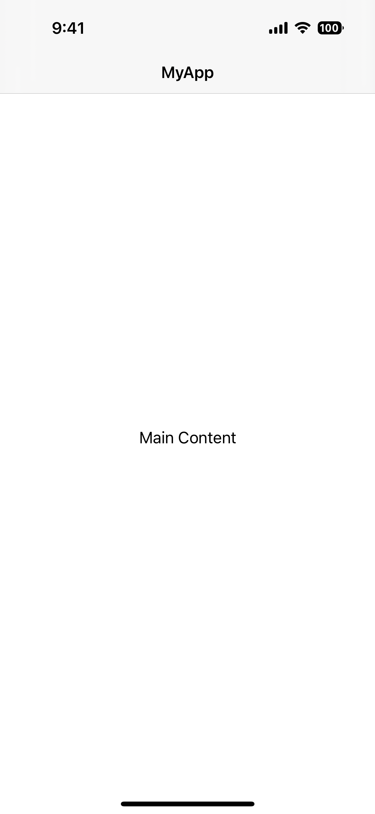
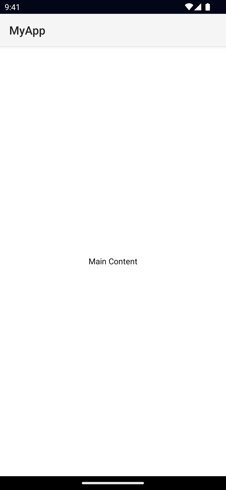

`<ActionBar>` is NativeScript’s abstraction over the Android [ActionBar](https://developer.android.com/training/appbar/) and iOS [NavigationBar](https://developer.apple.com/design/human-interface-guidelines/ios/bars/navigation-bars/). It represents a toolbar at the top of the activity window, and can have a title, application-level navigation, as well as other custom interactive items.

Views also part of the ActionBar abstraction:

- [ActionItem](#action-item)
- [NavigationButton](#navigation-button)

<DeviceFrame type="ios">

</DeviceFrame>
<DeviceFrame type="android">

</DeviceFrame>

<<< @/../examples/src/ui/ActionBar/page.xml#example

## Examples

### ActionBar with a custom title view

```xml
<ActionBar>
  <GridLayout columns="auto, *" width="100%">
    <Image src="~/assets/icon.png" width="40" height="40" />
    <Label text="Custom Title" fontSize="24" />
  </GridLayout>
</ActionBar>
```

### ActionBar with an always visible Android icon

```xml
<ActionBar
  title="ActionBar Title"
  android.icon="res://icon"
  android.iconVisibility="always"
/>
```

### Customizing the ActionBar

```xml
<ActionBar title="MyApp">
  <!-- explicitly hide the back button -->
  <NavigationButton visibility="collapsed" />

  <!-- show a Font Awesome icon on the left -->
  <ActionItem
    position="left"
    icon="font://&#xf0a8;"
    class="fas"
    tap="goBack"
  />

  <!-- Show a custom ActionItem on the right -->
  <ActionItem ios.position="right">
    <GridLayout width="100">
      <Button text="Action Item" />
    </GridLayout>
  </ActionItem>
</ActionBar>
```

:::warning Note
On iOS, setting the `color` only affects the title and the action items.

On Android, `color` only affects the title. You can set the default color of the ActionItems by setting `actionMenuTextColor` in `App_Resources\Android\values\styles.xml`.
:::

### Removing the border from the ActionBar

By default, a border is drawn at the bottom of the ActionBar. In addition to the border, on iOS a translucency filter is also applied over the ActionBar. To remove the border and the translucency, set `flat="true"`:

```xml
<ActionBar title="MyApp" flat="true" />
```

:::tip 8.9+
You can alternatively use `iosShadow="false"` in the event you want to keep the translucency but remove the border.
:::


```xml
<ActionBar title="MyApp" iosShadow="false" />
```

## Props

### title

```ts
title: string
```

Gets or sets the ActionBar title.

::: tip 8.9+
On iOS, you can also enable prefersLargeTitles by setting `iosLargeTitle="true"`
:::

```xml
<ActionBar title="MyApp" iosLargeTitle="true" />
```

### titleView

```ts
titleView: View
```

Replaces the title property with the custom view.

**Note**: this is the property set when defining a custom child view in xml (Unless an instance of ActionItem, or NavigationButton).

See [View](/api/class/View).

### flat

```ts
flat: boolean
```

Removes the border on Android and the translucency on iOS.

Defaults to `false`.

### navigationButton

```ts
navigationButton: NavigationButton
```

Gets or sets the navigation button (back button).

See [NavigationButton](#navigation-button).

### actionItems

```ts
actionItems: ActionItems
```

Gets or sets the ActionItems.

See [ActionItem](#action-item).

### iosIconRenderingMode

```ts
actionBar.iosIconRenderingMode
```

Gets or set the [UIImage.RenderingMode](https://developer.apple.com/documentation/uikit/uiimage/renderingmode) of the ActionBar icons in iOS.

Available values:

- `automatic`
- `alwaysTemplate`
- `alwaysOriginal`

Defaults to `alwaysOriginal`.

## ActionItem {#action-item}

`<ActionItem>` is a UI component for adding action buttons to the ActionBar.

```xml
<ActionBar title="MyApp">
  <ActionItem
    ios.systemIcon="9" ios.position="left"
    android.systemIcon="ic_menu_share" android.position="actionBar" />
  <ActionItem
    ios.systemIcon="16" ios.position="right"
    text="delete" android.position="popup" />
</ActionBar>
```

## ActionItem Props

### text

```ts
text: string
```

Gets or sets the text of the ActionItem.

### icon

```ts
icon: string
```

Gets or sets the icon of the action item. Supports local images (`~/`), resources (`res://`) and fonts icons (`fonts://`)

### ios.position

```ts
ios.position: 'left' | 'right'
```

Sets the position of the ActionItem on iOS. **iOS only.**

Avaibable values:

- `left`: Puts the item on the left side of the ActionBar.
- `right`: Puts the item on the right side of the ActionBar.

Defaults to `left`.

### android.position

```ts
android.position: 'actionBar' | 'popup' | 'actionBarIfRoom'
```

Sets the position of the ActionItem on Android. **Android only.**

Avaibable values:

- `actionBar`: puts the item in the ActionBar. Action item can be rendered both as text or icon.
- `popup`: puts the item in the options menu. Items will be rendered as text.
- `actionBarIfRoom`: puts the item in the ActionBar if there is room for it. Otherwise, puts it in the options menu.

Defaults to `actionBar`.

### ios.systemIcon

```ts
ios.systemIcon: string
```

Sets the icon of the ActionItem using a [UIBarButton.SystemIcon](https://developer.apple.com/documentation/uikit/uibarbuttonsystemitem). **iOS only.**

### android.systemIcon

```xml
android.systemIcon: string
```

Sets the icon of the ActionItem. For a list of system icons, refer to `R.drawable`. **Android only.**

See [R.drawable](https://developer.android.com/reference/android/R.drawable).

<!-- textlint-disable terminology -->

### actionBar

<!-- textlint-enable-->

```ts
actionBar: ActionBar
```

Gets the ActionBar that contains the ActionItem.

## NavigationButton {#navigation-button}

`<NavigationButton>` is a UI component providing an abstraction for the Android navigation button and the iOS back button.

```xml
<ActionBar title="MyApp">
  <NavigationButton text="Go back" android.systemIcon="ic_menu_back" />
</ActionBar>
```

:::tip Platform specific behavior

**iOS Specific**

On iOS the default text of the NavigationButton is the title of the previous page and the back button is used explicitly for navigation.
It navigates to the previous page and does not allow overriding this behavior.
If you need to place a custom button on the left side of the `<ActionBar>` (e.g., to show a Drawer button), you can use an ActionItem with `ios.position="left"`.

**Android Specific**

On Android, you can't add text inside the NavigationButton.
You can use the icon property to set an image (e.g., `~/images/nav-image.png` or `res:\\ic_nav`).
You can use `android.systemIcon` to set one of the system icons available in Android.
In this case, there is no default behavior for NavigationButton tap event, instead the passed-in callback will be called.

:::

## NavigationButton Props

### text

```ts
text: string
```

Sets the text of the back button. **iOS only.**

### android.systemIcon

```ts
android.systemIcon: string
```

The icon to be shown in the button. You can specify any system icon whose name begins with the ic\_ prefix. For a complete list of the available icons, see the `R.drawable`. **Android only.**

See [R.drawable](https://developer.android.com/reference/android/R.drawable.html)

## Native component

### ActionBar

- Android: [android.widget.Toolbar](https://developer.android.com/reference/android/widget/Toolbar.html)
- iOS: [UINavigationBar](https://developer.apple.com/documentation/uikit/uinavigationbar?language=objc)

### ActionItem

- Android: [android.widget.Toolbar](https://developer.android.com/reference/android/widget/Toolbar.html)
- iOS: [UINavigationItem](https://developer.apple.com/documentation/uikit/uinavigationitem?language=objca)

### NavigationButton

- Android: [android.widget.Toolbar](https://developer.android.com/reference/android/widget/Toolbar.html)
- iOS: [UINavigationItem](https://developer.apple.com/documentation/uikit/uinavigationitem?language=objca)
