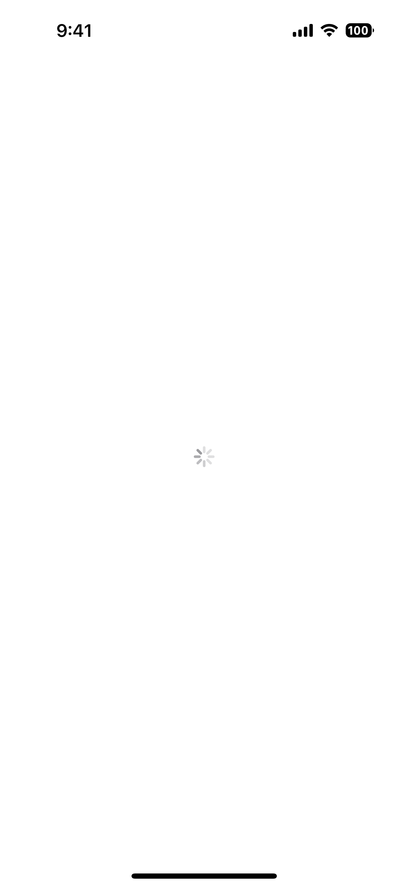
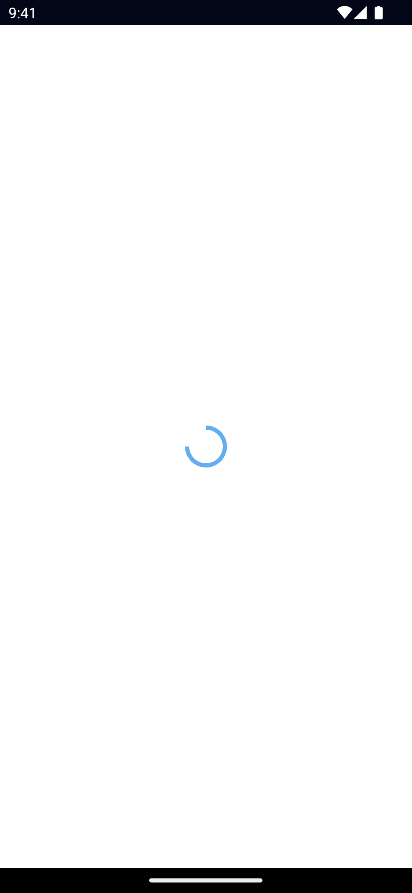

`<ActivityIndicator>` is a UI component that shows a progress indicator signaling to the user of an operation running in the background.

<DeviceFrame type="ios">

</DeviceFrame>
<DeviceFrame type="android">

</DeviceFrame>

## Examples

### Always busy ActivityIndicator

<Tabs>
<Tab flavor="vue">

<<< @/../examples/vue/src/ui/ActivityIndicator/component.vue#example

</Tab>
<Tab flavor="typescript">

<<< @/../examples/typescript/src/ui/ActivityIndicator/template.xml#example

</Tab>
<Tab flavor="angular">

<<< @/../examples/angular/src/ui/ActivityIndicator/component.html#example

</Tab>
<Tab flavor="svelte">

<<< @/../examples/svelte/app/components/ui/ActivityIndicator.svelte#example

</Tab>
<Tab flavor="react">

<<< @/../examples/react/src/components/ui/activityindicator.tsx#example

</Tab>

</Tab>
<Tab flavor="solid">

<<< @/../examples/solid/src/ui/activityindicator.tsx#example

</Tab>
</Tabs>

## Props

### busy

```ts
busy: boolean
```

Gets or sets whether the indicator is busy.

### iosIndicatorViewStyle 8.9+

```ts
iosIndicatorViewStyle: IOSIndicatorViewStyle = 'medium' | 'large'
```

Specifies the style of the indicator. This property is iOS specific.

Valid values: `medium` and `large`.

Default value: `medium`.

---

### ...Inherited

For additional inherited properties, refer to the [API Reference](/api/class/ActivityIndicator).

## Events

### busyChange

```ts
on('busyChange', (args: EventData) => {
  const indicator = args.object as ActivityIndicator
  console.log(`indicator.busy changed to: ${indicator.busy}`)
})
```

Emitted when the busy property changes.

See [EventData](/api/interface/EventData).

## Native component

- Android: [`android.widget.ProgressBar` (indeterminate = true)](https://developer.android.com/reference/android/widget/ProgressBar.html)
- iOS: [`UIActivityIndicatorView`](https://developer.apple.com/documentation/uikit/uiactivityindicatorview)
