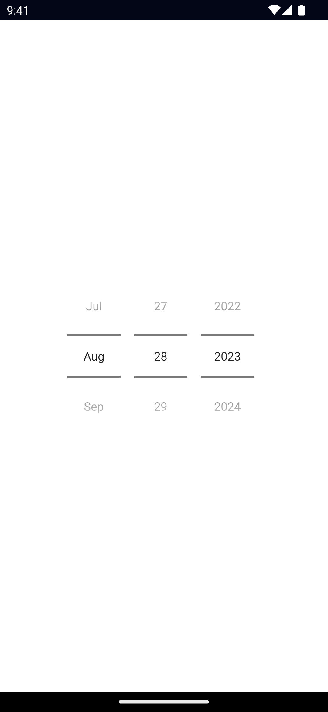

`<DatePicker>` is a UI component that lets users select a date from a pre-configured range.

See also: [TimePicker](/ui/time-picker).

<DeviceFrame type="ios">

</DeviceFrame>
<DeviceFrame type="android">

</DeviceFrame>

<<< @/../examples/typescript/src/ui/DatePicker/template.xml#example

```xml
<DatePicker
  year="2023"
  month="8"
  day="28"
  date="{{ date }}"
  minDate="{{ minDate }}"
  maxDate="{{ maxDate }}"
/>
```

## Props

### date

```ts
date: Date
```

Gets or sets the complete date.

### minDate

```ts
minDate: Date
```

Gets or sets the earliest possible date to select.

### maxDate

```ts
maxDate: Date
```

Gets or sets the latest possible date to select.

### day

```ts
day: number
```

Gets or sets the day of the month.

### month

```ts
month: number
```

Gets or sets the month.

### year

```ts
year: number
```

Gets or sets the year.

### iosPreferredDatePickerStyle

```ts
iosPreferredDatePickerStyle: UIDatePickerStyle
```

Gets or set the UIDatePickerStyle of the DatePicker in iOS `13.4+`.

Default value: `0` (automatic).

Valid values:

- `0 = automatic`: system picks the concrete style based on the current platform and DatePicker mode.
- `1 = wheels`: the DatePicker displays as a wheel picker.
- `2 = compact` : the DatePicker displays as a label that when tapped displays a calendar-style editor.
- `3 = inline` : the DatePickers displays as an inline, editable field

## Events

### dateChange

```ts
on('dateChange', (args: PropertyChangeData) => {
  const picker = args.object as DatePicker
  console.log('New date:', args.value)
})
```

Emitted when the selected date changes.

See [PropertyChangeData](/api/interface/PropertyChangeData).

### minDateChange

```ts
on('minDateChange', (args: PropertyChangeData) => {
  const picker = args.object as DatePicker
  console.log('New minDate:', args.value)
})
```

Emitted when the minimum date changes.

See [PropertyChangeData](/api/interface/PropertyChangeData).

### maxDateChange

```ts
on('maxDateChange', (args: PropertyChangeData) => {
  const picker = args.object as DatePicker
  console.log('New maxDate:', args.value)
})
```

Emitted when the maximum date changes.

See [PropertyChangeData](/api/interface/PropertyChangeData).

### dayChange

```ts
on('dayChange', (args: PropertyChangeData) => {
  const picker = args.object as DatePicker
  console.log('New day:', args.value)
})
```

Emitted when the day changes.

See [PropertyChangeData](/api/interface/PropertyChangeData).

### monthChange

```ts
on('monthChange', (args: PropertyChangeData) => {
  const picker = args.object as DatePicker
  console.log('New month:', args.value)
})
```

Emitted when the month changes.

See [PropertyChangeData](/api/interface/PropertyChangeData).

### yearChange

```ts
on('yearChange', (args: PropertyChangeData) => {
  const picker = args.object as DatePicker
  console.log('New year:', args.value)
})
```

Emitted when the year changes.

See [PropertyChangeData](/api/interface/PropertyChangeData).

## Native component

- Android: [`android.widget.DatePicker`](https://developer.android.com/reference/android/widget/DatePicker.html)
- iOS: [`UIDatePicker`](https://developer.apple.com/documentation/uikit/uidatepicker)
