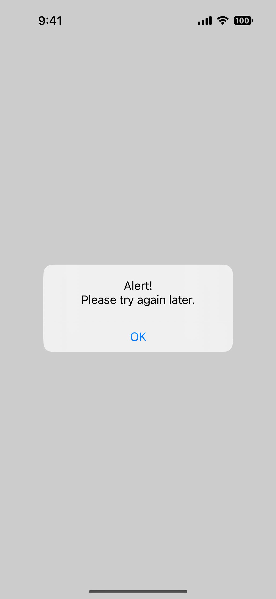
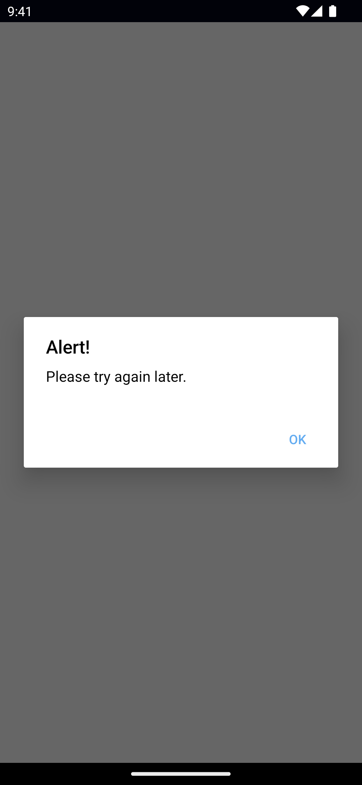
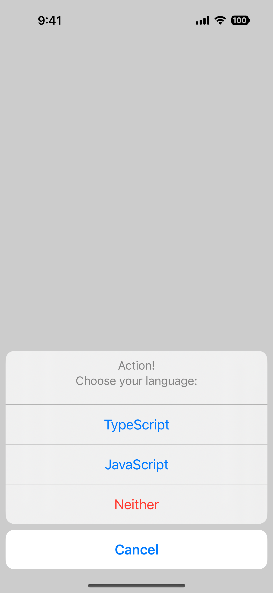
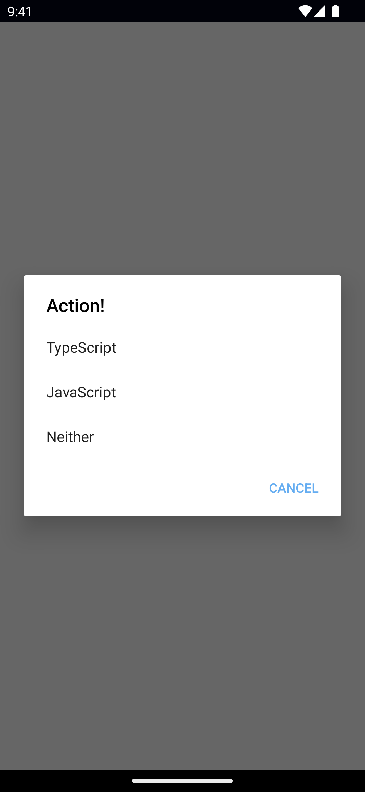
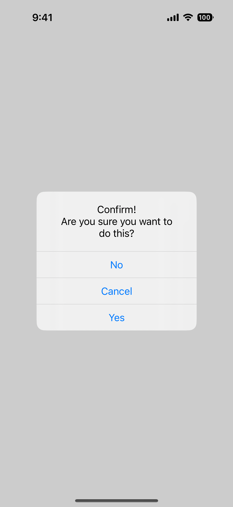
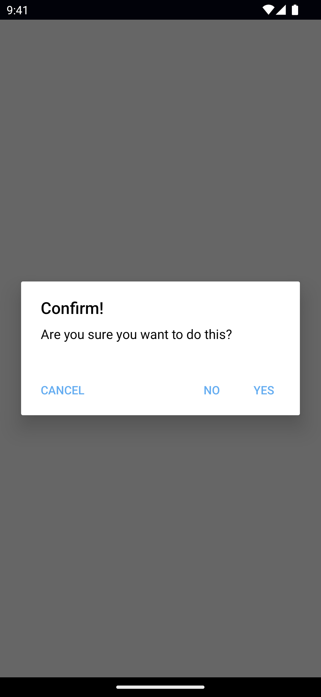
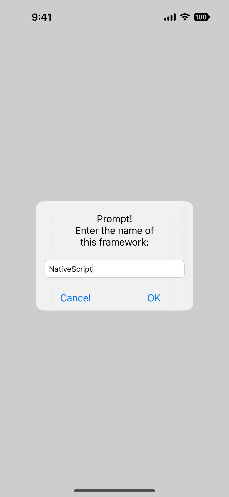
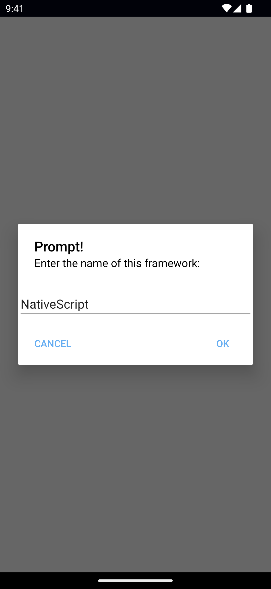
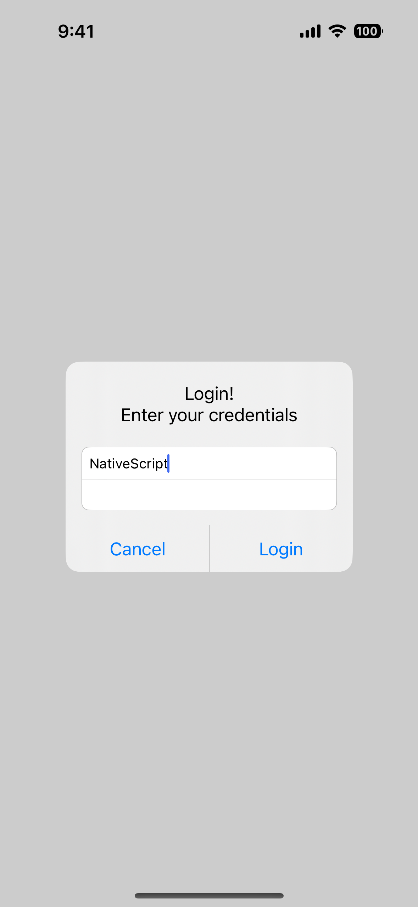
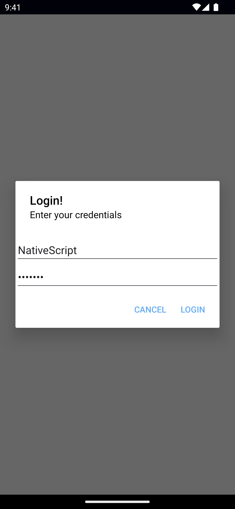

NativeScript offers various dialogs, available via the `Dialogs` import from `@nativescript/core`, or globally.

```ts
import { Dialogs } from '@nativescript/core'

Dialogs.alert(options)
Dialogs.action(options)
Dialogs.confirm(options)
Dialogs.prompt(options)
Dialogs.login(options)

// is the same as:
alert(options)
action(options)
confirm(options)
prompt(options)
login(options)
```

All dialogs take a `DialogOptions` object with the properties:

- `title`: Sets the dialog title.
- `message` : Sets the dialog message.
- `cancelable` (**Android only**): Sets if the dialog can be canceled by taping outside of the dialog.
- `theme` (**Android only**): Sets the theme of the Dialog. Usable themes can be found in [R.style](https://developer.android.com/reference/android/R.style)

See [DialogOptions](/api/interface/DialogOptions), [R.style](https://developer.android.com/reference/android/R.style).

## Avialable Dialogs

### Alert {#alert}

<DeviceFrame type="ios">

</DeviceFrame>
<DeviceFrame type="android">

</DeviceFrame>

<<< @/../examples/typescript/src/ui/Dialogs/template.ts#example-alert
<<< @/../examples/angular/src/ui/Dialogs/component.html#example-alert
<<< @/../examples/react/src/components/ui/dialogs.tsx#example-alert
<<< @/../examples/solid/src/ui/dialogs.tsx#example-alert
<<< @/../examples/svelte/app/components/ui/Dialogs.svelte#example-alert
<<< @/../examples/vue/src/ui/Dialogs/component.vue#example-alert

A dialog for alerting the user.

See [alert()](/api/#alert).

### Action {#action}

<DeviceFrame type="ios">

</DeviceFrame>
<DeviceFrame type="android">

</DeviceFrame>

<<< @/../examples/typescript/src/ui/Dialogs/template.ts#example-action
<<< @/../examples/angular/src/ui/Dialogs/component.html#example-action
<<< @/../examples/react/src/components/ui/dialogs.tsx#example-action
<<< @/../examples/solid/src/ui/dialogs.tsx#example-action
<<< @/../examples/svelte/app/components/ui/Dialogs.svelte#example-action
<<< @/../examples/vue/src/ui/Dialogs/component.vue#example-action

A dialog for prompting the user to choose.

**Note**: `destructiveActionsIndexes` allows setting some actions as destructive - shown in red. **iOS only.**

See [action()](/api/#action).

### Confirm {#confirm}

<DeviceFrame type="ios">

</DeviceFrame>
<DeviceFrame type="android">

</DeviceFrame>

<<< @/../examples/typescript/src/ui/Dialogs/template.ts#example-confirm
<<< @/../examples/angular/src/ui/Dialogs/component.html#example-confirm
<<< @/../examples/react/src/components/ui/dialogs.tsx#example-confirm
<<< @/../examples/solid/src/ui/dialogs.tsx#example-confirm
<<< @/../examples/svelte/app/components/ui/Dialogs.svelte#example-confirm
<<< @/../examples/vue/src/ui/Dialogs/component.vue#example-confirm

A dialog for prompting the user to confirm.

See [confirm()](/api/#confirm).

### Prompt {#prompt}

<DeviceFrame type="ios">

</DeviceFrame>
<DeviceFrame type="android">

</DeviceFrame>

<<< @/../examples/typescript/src/ui/Dialogs/template.ts#example-prompt
<<< @/../examples/angular/src/ui/Dialogs/component.html#example-prompt
<<< @/../examples/react/src/components/ui/dialogs.tsx#example-prompt
<<< @/../examples/solid/src/ui/dialogs.tsx#example-prompt
<<< @/../examples/svelte/app/components/ui/Dialogs.svelte#example-prompt
<<< @/../examples/vue/src/ui/Dialogs/component.vue#example-prompt

A dialog for prompting the user for input.

- `defaultText`: Sets the default text to display in the input box.
- `inputType`: Sets the prompt input type: `email`, `decimal`, `phone`, `number`, `text`, `password`, or `email`
- `capitalizationType`: Sets the prompt capitalization type. Avalable options: `none`, `allCharacters`, `sentences`, or `words`.

See [prompt()](/api/#prompt), [CoreTypes.AutocapitalizationType](/api/namespace/CoreTypes-AutocapitalizationType)

### Login {#login}

<DeviceFrame type="ios">

</DeviceFrame>
<DeviceFrame type="android">

</DeviceFrame>

<<< @/../examples/typescript/src/ui/Dialogs/template.ts#example-login
<<< @/../examples/angular/src/ui/Dialogs/component.html#example-login
<<< @/../examples/react/src/components/ui/dialogs.tsx#example-login
<<< @/../examples/solid/src/ui/dialogs.tsx#example-login
<<< @/../examples/svelte/app/components/ui/Dialogs.svelte#example-login
<<< @/../examples/vue/src/ui/Dialogs/component.vue#example-login

A dialog for prompting the user for credentials.

See [login()](/api/#login).

## Native Component

- Android: [android.app.AlertDialog.Builder](https://developer.android.com/reference/android/app/AlertDialog.Builder)
- iOS: [UIAlertController](https://developer.apple.com/documentation/uikit/uialertcontroller)
