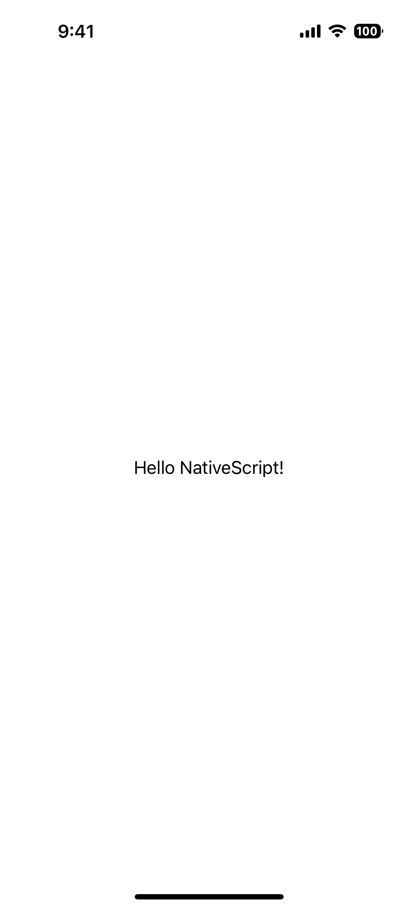

<!-- TODO: Add flavors -->

`<Label>` is a UI component that displays read-only text.

::: warning Note
The NativeScript `<Label>` is not the same as the HTML `<Label>`.
:::

<DeviceFrame type="ios">

</DeviceFrame>
<DeviceFrame type="android">

</DeviceFrame>

<<< @/../examples/src/ui/Label/template.xml#example

## Examples

### Formatting text inside a button

If you need to style parts of the text, you can use a combination of a `FormattedString` and `Span` elements.

```xml
<Label textWrap="true">
  <FormattedString>
    <Span text="This text has a " />
    <Span text="red " style="color: red" />
    <Span text="piece of text. " />
    <Span text="Also, this bit is italic, " fontStyle="italic" />
    <Span text="and this bit is bold." fontWeight="bold" />
  </FormattedString>
</Label>
```

## Props

### letterSpacing

```ts
letterSpacing: number
```

Gets or sets the letter spacing.

See [MDN: CSS letter-spacing](https://developer.mozilla.org/en-US/docs/Web/CSS/letter-spacing).

### lineHeight

```ts
lineHeight: number
```

Gets or sets the line height.

See [MDN: CSS line-height](https://developer.mozilla.org/en-US/docs/Web/CSS/line-height).

### text

```ts
text: string
```

Gets or sets the text shown.

### textAlignment

```ts
textAlignment: 'initial' | 'left' | 'center' | 'right' = 'left'
```

Gets or sets the text alignment style property.

Defaults to `left`.

### textDecoration

```ts
textDecoration: TextDecorationType // "none" | "underline" | "line-through" | "underline line-through"
```

Gets or sets the text decoration style.

See [TextDecorationType](/api/namespace/CoreTypes#textdecorationtype).

Defaults to `none`.

### textTransform

```ts
textTransform: TextTransformType // "initial" | "none" | "capitalize" | "uppercase" | "lowercase"
```

Gets or sets the text transform.

See [TextTransformType](/api/namespace/CoreTypes#texttransformtype).

Defaults to `initial`.

### textWrap

```ts
textWrap: boolean
```

Gets or sets whether the label should wrap longer text to new lines.

Default value is `false`.

### whiteSpace

```ts
whiteSpace: WhiteSpaceType // "initial" | "normal" | "nowrap"
```

Gets or sets white-space handling.

See [WhiteSpaceType](/api/namespace/CoreTypes#whitespacetype) and [MDN: CSS white-space](https://developer.mozilla.org/en-US/docs/Web/CSS/white-space).

Defaults to `initial`.

### ...Inherited

For additional inherited properties, refer to the [API Reference](/api/class/Label).

<!-- note: commented out - does it make sense to cover textChange? There's rarely a need to listen to this in real apps, so perhaps it's better to just document/link to the Property System page (once ready) that covers how every property emits {property}Change events. -->
<!-- ## Events

### textChange

```ts
on('textChange', (args: PropertyChangeData) => {
  const label = args.object as Label
  console.log('Label text changed to:', args.value)
})
```

Emitted when the label text is changed. -->

## Native component

| Android                                                                                           | iOS                                                                  |
| ------------------------------------------------------------------------------------------------- | -------------------------------------------------------------------- |
| [`android.widget.TextView`](https://developer.android.com/reference/android/widget/TextView.html) | [`UILabel`](https://developer.apple.com/documentation/uikit/uilabel) |
