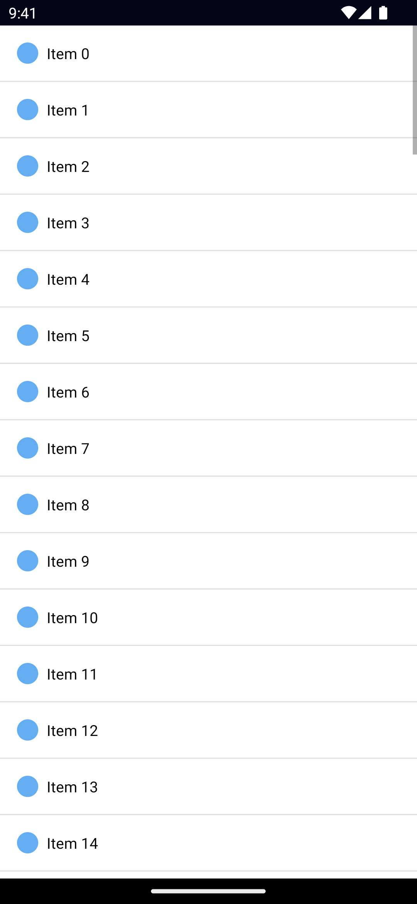

`<ListView>` is a UI component that renders items in a vertically scrolling list, the template for the items can be defined via `itemTemplate` (or multiple templates via `itemTemplates` - more on that below). The ListView only renders the visible items, as the user scrolls, new items render by reusing a no-longer-visible item's view&mdash;this is usually referred to as view-recycling.

::: tip

For additional features and improved performance in certain scenarios, consider using an alternative implementation like the
[CollectionView](https://github.com/nativescript-community/ui-collectionview) from the community.

:::

<DeviceFrame type="ios">

</DeviceFrame>
<DeviceFrame type="android">

</DeviceFrame>

<Tabs>
<Tab flavor="typescript">

::: code-group
<<< @/../examples/typescript/src/ui/ListView/template.xml#example [XML]
<<< @/../examples/typescript/src/ui/ListView/template.ts#example [TypeScript]
:::

</Tab>
<Tab flavor="angular">

::: code-group
<<< @/../examples/angular/src/ui/ListView/component.html#example [HTML]
<<< @/../examples/angular/src/ui/ListView/component.ts#example [TypeScript]
:::

</Tab>
<Tab flavor="react">

<<< @/../examples/react/src/components/ui/listview.tsx#example

</Tab>
<Tab flavor="solid">

<<< @/../examples/solid/src/ui/listview.tsx#example

</Tab>
<Tab flavor="svelte">

<<< @/../examples/svelte/app/components/ui/ListView.svelte#example

</Tab>
<Tab flavor="vue">

<<< @/../examples/vue/src/ui/ListView/component.vue#example

</Tab>
</Tabs>

## Examples

### ListView with multiple itemTemplates

Individual items can be rendered using a different template. For example, let's say our items can either be headings or items. In that case, we can define a template for them, and pass in an `itemTemplateSelector` function that will get called before rendering an item.

<Tabs>
<Tab flavor="typescript">

::: code-group
<<< @/../examples/typescript/src/ui/ListView/multiple-templates.xml#example [XML]
<<< @/../examples/typescript/src/ui/ListView/template.ts#itemTemplateSelector [TypeScript]
:::

</Tab>
</Tabs>

## Props

### items

```ts
items: Array | ObservableArray
```

Gets or set the items of the `ListView`.

For static lists using an Array is fine, however for dynamically changed arrays it's recommended to use an ObservableArray to optimize re-rendering performance.

See [ObservableArray](/api/class/ObservableArray).

### itemTemplateSelector

```ts
itemTemplateSelector: (
  item: T,
  index: number,
  items: Array | ObservableArray,
) => string
```

A function to be called when selecting the template for the item.

### itemTemplate

```ts
itemTemplate: KeyedTemplate
```

Gets or sets the default item template.

**Note**: this is usually set by the framwork (eg. `ListView.itemTemplate` via xml).

See [KeyedTemplate](/api/interface/KeyedTemplate).

### itemTemplates

```ts
itemTemplates: KeyedTemplate[]
```

Gets or sets the available itemTemplates.

**Note**: this is usually set by the framwork (eg. `ListView.itemTemplates` via xml).

See [KeyedTemplate](/api/interface/KeyedTemplate).

### separatorColor

```ts
separatorColor: Color
```

Gets or sets the color of the line separating each item.

::: tip
Set the `separatorColor` to `transparent` to hide it, or use your own borders.
:::

See [Color](/api/class/Color).

### rowHeight

```ts
rowHeight: number
```

Gets or sets the row height of the ListView. Useful when your items have a fixed height, as the required calculations are greatly simplified and the rendering can be faster.

### iosEstimatedRowHeight

Gets or sets the estimated height of rows in the ListView. Default value: `44px`

### ...Inherited

For additional inherited properties, refer to the [API Reference](/api/class/ListView).

## Methods

### refresh()

```ts
listView.refresh()
```

Forces the ListView to reload all its items.

### scrollToIndex()

```ts
listView.scrollToIndex(index: number)
```

Scrolls the item with the specified index into view.

### scrollToIndexAnimated()

```ts
listView.scrollToIndexAnimated(index: number)
```

Scrolls the item with the specified index into view with animation.

### isItemAtIndexVisible()

```ts
listView.isItemAtIndexVisible(index: number) // boolean
```

Checks if the item with the specified index is visible.

## Events

### itemTap

```ts
on('itemTap', (args: ItemEventData) => {
  const listView = args.object as ListView
  console.log('Tapped index', args.index)
  console.log('Tapped item', listView.items[args.index])
})
```

Emitted when a user taps an item in the ListView.

See [ItemEventData](/api/interface/ItemEventData).

### itemLoading

```ts
on('itemLoading', (args: ItemEventData) => {
  const listView = args.object as ListView
})
```

Emitted when the ListView is loading/recycling an item. `args.view` is set if the ListView is recycling an item, otherwise it's `undefined`.

**Note**: frameworks use this event to update the `args.view` with new data.

See [ItemEventData](/api/interface/ItemEventData).

### loadMoreItems

```ts
on('loadMoreItems', (args: EventData) => {
  const listView = args.object as ListView

  // example: add new items
  listView.items.push(newItems)
})
```

Emitted when the user reaches the end of the ListView. Useful for loading additional items (ie. infinite scroll).

## Native component

- Android: [`android.widget.ListView`](https://developer.android.com/reference/android/widget/ListView.html)
- iOS: [`UITableView`](https://developer.apple.com/documentation/uikit/uitableview)
