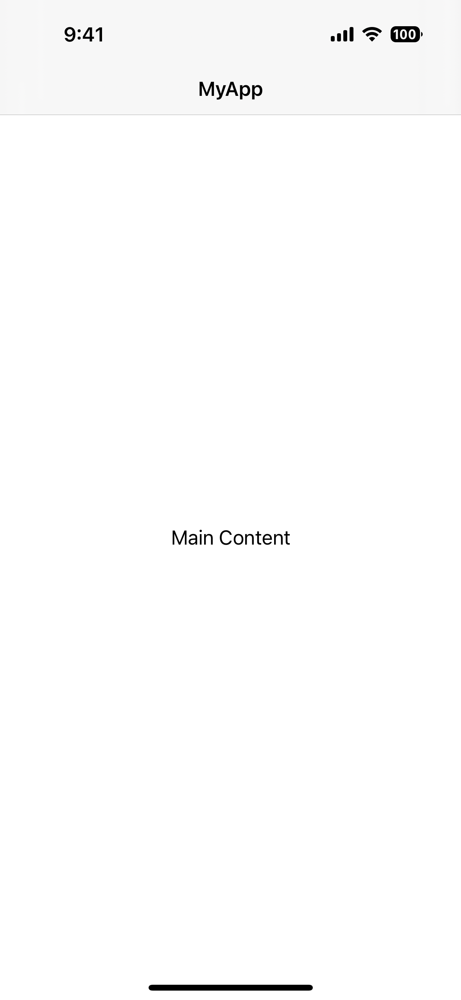
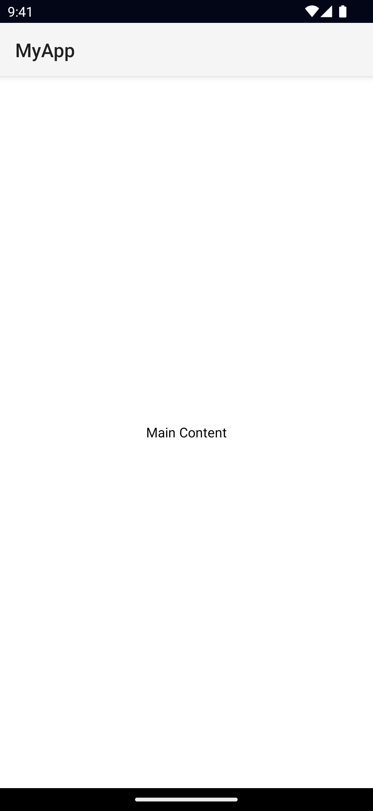
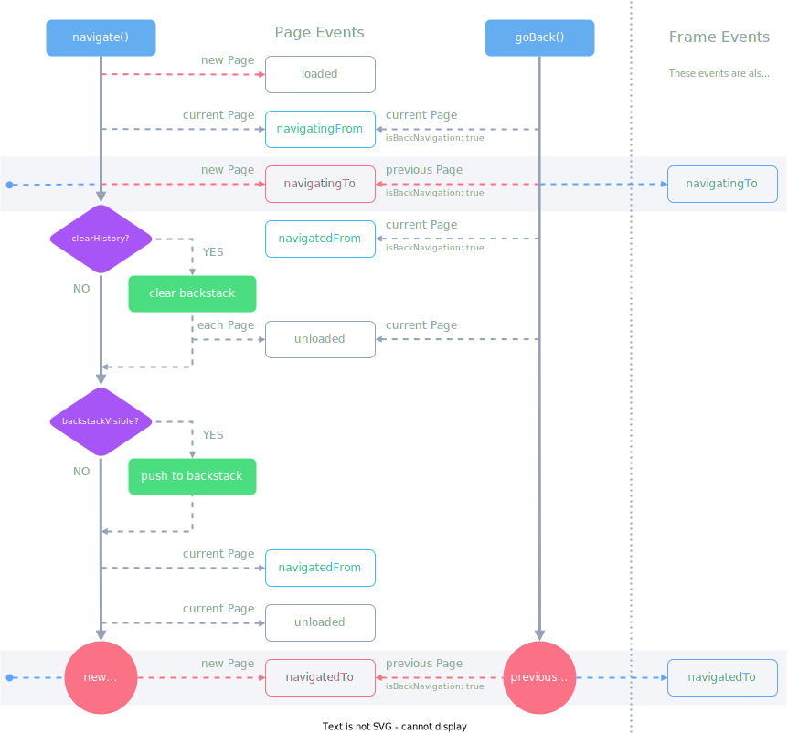

`<Page>` is a UI component for representing screens that users are able to navigate to through a [Frame](/ui/frame). A Page itself can only contain a single child view with the exception of the [ActionBar](/ui/action-bar) which has it's own special "slot".

<!-- reusing ActionBar screenshot -->
<DeviceFrame type="ios">

</DeviceFrame>
<DeviceFrame type="android">

</DeviceFrame>

```xml
<Page>
  <ActionBar title="MyApp" />

  <!-- the main content - must be a single view -->
  <GridLayout>
    <Label text="Main Content" />
  </GridLayout>
</Page>
```

## Page Lifecycle

A page emits various events during navigation that you can use to update data/state in your app.



### Lifecycle event examples

::: details Navigating forward and back

```bash
# frame.navigate('mainPage') - initial navigation
mainPage > loaded
mainPage > navigatingTo (isBackNavigation: false)
mainPage > layoutChanged  # todo: check if this is correct
mainPage > navigatedTo (isBackNavigation: false)

# frame.navigate({ moduleName: 'detailsPage' })

mainPage > navigatingFrom (isBackNavigation: false)
detailsPage > navigatingTo (isBackNavigation: false)
mainPage > navigatedFrom (isBackNavigation: false)
detailsPage > navigatedTo (isBackNavigation: false)

# frame.goBack()

detailPage > navigatingFrom (isBackNavigation: true)
mainPage > navigatingTo (isBackNavigation: true)
detailsPage > navigatedFrom (isBackNavigation: true)
mainPage > navigatedTo (isBackNavigation: true)
detailsPage > unloaded # since it's no longer in the backstack
```

:::

::: details Navigating forward and clearing history

```bash
# frame.navigate('mainPage')
mainPage > loaded
mainPage > navigatingTo (isBackNavigation: false)
mainPage > layoutChanged  # todo: check if this is correct
mainPage > navigatedTo (isBackNavigation: false)

# frame.navigate({ moduleName: 'detailsPage', clearHistory: true })

mainPage > navigatingFrom (isBackNavigation: false)
detailsPage > navigatingTo (isBackNavigation: false)
mainPage > navigatedFrom (isBackNavigation: false)
detailsPage > navigatedTo (isBackNavigation: false)
mainPage > unloaded # since clearHistory: true

# frame.goBack() - no-op, there's nothing in the backstack.
```

:::

::: details Navigating forward without a backstack entry

```bash
# frame.navigate({ moduleName: 'mainPage', backstackVisible: false })
mainPage > loaded
mainPage > navigatingTo (isBackNavigation: false)
mainPage > layoutChanged  # todo: check if this is correct
mainPage > navigatedTo (isBackNavigation: false)

# frame.navigate({ moduleName: 'detailsPage', : true })

mainPage > navigatingFrom (isBackNavigation: false)
detailsPage > navigatingTo (isBackNavigation: false)
mainPage > navigatedFrom (isBackNavigation: false)
detailsPage > navigatedTo (isBackNavigation: false)
mainPage > unloaded # since backstackVisible: false, we won't be able to reach mainPage after this point
```

:::

## Examples

### Getting a reference to the current Page

NativeScript provides various ways to access the current Page instance.

#### Via Page Events

Any events emitted by the Page will have a reference to the Page itself via `args.object`. For example:

```ts
// loaded event
onPageLoaded(args: LoadEventData) {
  const page = args.object as Page;
}

// navigatedTo event
onNavigatedTo(args: NavigatedData) {
  const page = args.object as Page;
}
```

#### Via the page property of any View within the Page

Any View nested inside a Page hierarchy can access the Page via the `page` property.

```ts
onTap(args: EventData) {
  const button = args.object as Button
  const page = button.page as Page;
}
```

#### Via the currentPage property of a Frame instance

The currently displayed page can be accessed via the Frame, to get a reference to the frame you can use `Frame.topmost()` for example:

```ts
import { Frame } from '@nativescript/core'

const frame = Frame.topmost()
const page = frame.currentPage // Page
```

See [Frame](/ui/frame), [Getting a Frame Instance](/ui/frame#getting-a-frame-instance).

### Handling various Page events

A page emits various events during it's lifecycle, navigation events and general View events like `loaded`/`unloaded`/`layoutChanged` etc.

::: code-group

```xml [Page Definition]
<Page
  loaded="onLoaded"
  unloaded="onUnloaded"
  navigatedFrom="onNavigatedFrom"
  navigatedTo="onNavigatedTo"
  navigatingFrom="onNavigatingFrom"
  navigatingTo="onNavigatingTo"
  layoutChanged="onLayoutChanged"
>
  <ActionBar title="MyApp" />
  <!-- ... -->
</Page>
```

```ts [Event Handlers]
onLoaded(args: EventData) {
  const page = args.object as Page
}

onUnloaded(args: EventData) {
  const page = args.object as Page
}

onLayoutChanged(args: EventData) {
  const page = args.object as Page
}

onNavigatedTo(args: NavigatedData) {
  const page = args.object as Page
  console.log(args.isBackNavigation)
}

onNavigatingFrom(args: NavigatedData) {
  const page = args.object as Page
  console.log(args.isBackNavigation)
}

onNavigatedFrom(args: NavigatedData) {
  const page = args.object as Page
  console.log(args.isBackNavigation)
}
```

:::

## Props

<!-- textlint-disable terminology -->

### actionBar

<!-- textlint-enable -->

```ts
actionBar: ActionBar
```

Gets or sets the ActionBar for this page.

See [ActionBar](/ui/action-bar).

### actionBarHidden

```ts
actionBarHidden: boolean
```

Allows hiding the ActionBar.

Defaults to `false`.

### frame

```ts
frame: Frame
```

The Frame instance containing the page.

See [Frame](/ui/frame).

### navigationContext

```ts
navigationContext: any
```

A context used to pass data during navigation.

### backgroundSpanUnderStatusBar

```ts
backgroundSpanUnderStatusBar: boolean
```

Gets or sets whether the background of the page spans under the status bar.

Defaults to `false`.

### androidStatusBarBackground

```ts
androidStatusBarBackground: Color
```

Gets or sets the color of the status bar on Android devices. **Android only.**

See [Color](/api/class/Color).

### enableSwipeBackNavigation

```ts
enableSwipeBackNavigation: boolean
```

Gets or sets whether the page can be swiped back on iOS. **iOS only.**

Defaults to `true`.

### statusBarStyle

```ts
statusBarStyle: 'light' | 'dark'
```

Gets or sets the style of the status bar.

### ...Inherited

For additional inherited properties, refer to the [API Reference](/api/class/Page).

## Events

### loaded

```ts
on('loaded', (args: EventData) => {
  const page = args.object as Page
  console.log('Page loaded')
})
```

Emitted after the page has been loaded.

### navigatingTo

```ts
on('navigatingTo', (args: NavigatedData) => {
  const page = args.object as Page
  console.log('Page is being navigated to:', args.isBackNavigation)
})
```

Emitted before the app has navigated to the current page.

### navigatedTo

```ts
on('navigatedTo', (args: NavigatedData) => {
  const page = args.object as Page
  console.log('Page has been navigated to:', args.isBackNavigation)
})
```

Emitted after the app has navigated to the current page.

### navigatingFrom

```ts
on('navigatingFrom', (args: NavigatedData) => {
  const page = args.object as Page
  console.log('Page is being navigated from:', args.isBackNavigation)
})
```

Emitted before the app has navigated away from the current page.

### navigatedFrom

```ts
on('navigatedFrom', (args: NavigatedData) => {
  const page = args.object as Page
  console.log('Page has been navigated from:', args.isBackNavigation)
})
```

Emitted after the app has navigated away from the current page.

## Native component

- Android: [`org.nativescript.widgets.GridLayout`](https://github.com/NativeScript/NativeScript/blob/master/packages/ui-mobile-base/android/widgets/src/main/java/org/nativescript/widgets/GridLayout.java)
- iOS: [`UIViewController`](https://developer.apple.com/documentation/uikit/uiviewcontroller)
