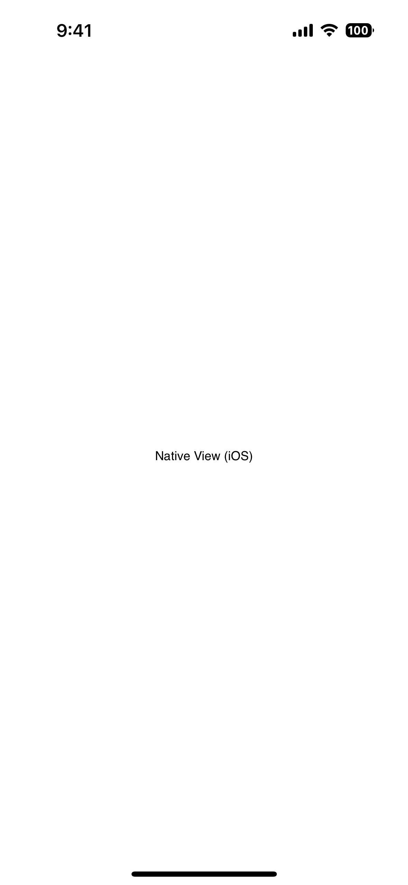

`<Placeholder>` allows adding native views directly in your markup without creating a full [View](#) wrapper for it. When NativeScript is constructing the UI and encounters a Placeholder element, it emits a `creatingView` event, allowing you to pass in any native view to be rendered by assigning it to the `args.view` parameter.

<DeviceFrame type="ios">

</DeviceFrame>
<DeviceFrame type="android">

</DeviceFrame>

<Tabs>
<Tab flavor="typescript">

<<< @/../examples/typescript/src/ui/Placeholder/template.xml#example
<<< @/../examples/typescript/src/ui/Placeholder/template.ts#example

</Tab>
<Tab flavor="angular">

<<< @/../examples/angular/src/ui/Placeholder/component.html#example
<<< @/../examples/angular/src/ui/Placeholder/component.ts#example

</Tab>
<Tab flavor="react">

<<< @/../examples/react/src/components/ui/placeholder.tsx#example

</Tab>
<Tab flavor="solid">

<<< @/../examples/solid/src/ui/placeholder.tsx#example

</Tab>
<Tab flavor="svelte">

<<< @/../examples/svelte/app/components/ui/Placeholder.svelte#example

</Tab>
<Tab flavor="vue">

<<< @/../examples/vue/src/ui/Placeholder/component.vue#example

</Tab>
</Tabs>

## Props

### ...Inherited

For additional inherited properties, refer to the [API Reference](/api/class/Placeholder).

## Events

### creatingView

```ts
on('creatingView', (args: CreateViewEventData) => {
  const placeholder = args.object as Placeholder
  args.view = someNativeView
})
```

Emitted when building the UI, the event args allow passing a native view instance back via `args.view`.

See [CreateViewEventData](/api/interface/CreateViewEventData)
