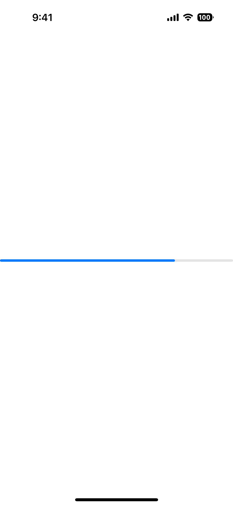
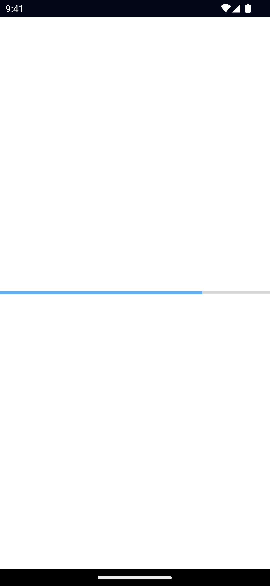

`<Progress>` is a UI component that shows a bar to indicate the progress of a task.

See also: [ActivityIndicator](/ui/activity-indicator).

<DeviceFrame type="ios">

</DeviceFrame>
<DeviceFrame type="android">

</DeviceFrame>

<Tabs>
<Tab flavor="typescript">

<<< @/../examples/typescript/src/ui/Progress/template.xml#example

</Tab>
<Tab flavor="angular">

<<< @/../examples/angular/src/ui/Progress/component.html#example

</Tab>
<Tab flavor="react">

<<< @/../examples/react/src/components/ui/progress.tsx#example

</Tab>
<Tab flavor="solid">

<<< @/../examples/solid/src/ui/progress.tsx#example

</Tab>
<Tab flavor="svelte">

<<< @/../examples/svelte/app/components/ui/Progress.svelte#example

</Tab>
<Tab flavor="vue">

<<< @/../examples/vue/src/ui/Progress/component.vue#example

</Tab>
</Tabs>

## Example

### Styling the Progress bar

To style the Progress bar, set the `backgroundColor` and `color`.

The `backgroundColor` will be applied to the track, and the `color` will be applied to the bar itself.

```xml
<Progress
  value="75"
  backgroundColor="#fff"
  color="#000"
/>
```

## Props

### value

```ts
value: number
```

Gets or sets the current value of the progress bar.

Must be within the range of 0 to [maxValue](#maxValue).

### maxValue {#maxValue}

```ts
maxValue: number
```

Gets or sets the maximum value of the progress bar.

Defaults to: `100`.

### ...Inherited

For additional inherited properties, refer to the [API Reference](/api/class/Progress)

## Native component

- Android: [`android.widget.ProgressBar` (indeterminate = false)](https://developer.android.com/reference/android/widget/ProgressBar.html)
- iOS: [`UIProgressView`](https://developer.apple.com/documentation/uikit/uiprogressview)
