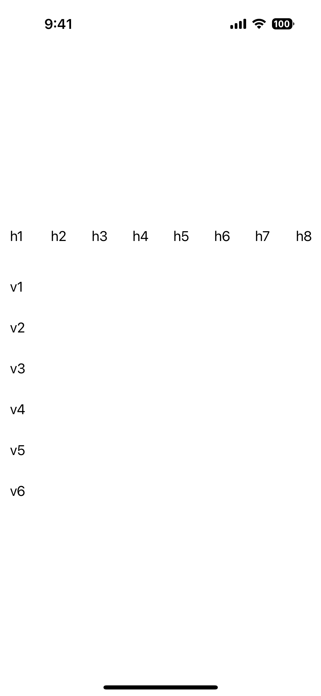
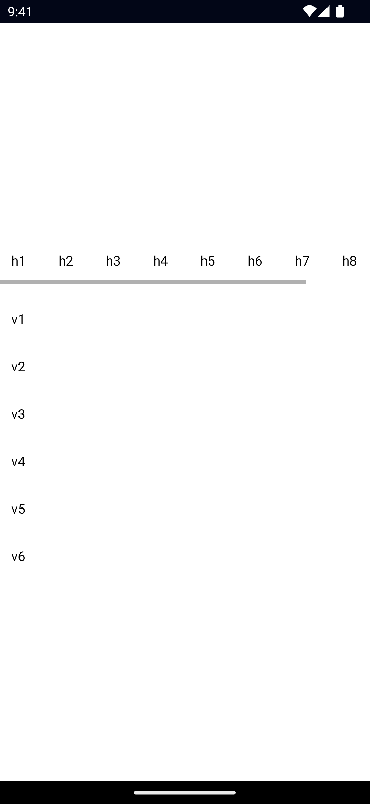

`<ScrollView>` is a UI component for rendering scrollable content. Content can be scrolled `vertically` (default) or `horizontally`.

::: warning Note

A ScrollView can only have a single child element.

:::

<DeviceFrame type="ios">

</DeviceFrame>
<DeviceFrame type="android">

</DeviceFrame>

<Tabs>
<Tab flavor="typescript">

<<< @/../examples/typescript/src/ui/ScrollView/template.xml#example

</Tab>
<Tab flavor="angular">

<<< @/../examples/angular/src/ui/ScrollView/component.html#example

</Tab>
<Tab flavor="react">

<<< @/../examples/react/src/components/ui/scrollview.tsx#example

</Tab>
<Tab flavor="solid">

<<< @/../examples/solid/src/ui/scrollview.tsx#example

</Tab>
<Tab flavor="svelte">

<<< @/../examples/svelte/app/components/ui/ScrollView.svelte#example

</Tab>
<Tab flavor="vue">

<<< @/../examples/vue/src/ui/ScrollView/component.vue#example

</Tab>
</Tabs>

## Props

### orientation

```ts
orientation: 'horizontal' | 'vertical'
```

Gets or sets the direction in which the content can be scrolled.

Defaults to `vertical`.

### scrollBarIndicatorVisible

```ts
scrollBarIndicatorVisible: boolean
```

Specifies if the scrollbar is visible.

Defaults to `true`.

### isScrollEnabled

```ts
isScrollEnabled: boolean
```

Enables or disables scrolling of the ScrollView.

### verticalOffset {#verticalOffset}

```ts
verticalOffset: number
```

Gets the vertical offset of the scrolled content.

### horizontalOffset {#horizontalOffset}

```ts
horizontalOffset: number
```

Gets the horizontal offset of the scrolled content.

### scrollableHeight

```ts
scrollableHeight: number
```

Gets the maximum scrollable height, this is also the maximum value for the [verticalOffset](#verticalOffset).

### scrollableWidth

```ts
scrollableWidth: number = scrollView.scrollableWidth
```

Gets the maximum scrollable width, this is also the maximum value for the [horizontalOffset](#horizontalOffset).

## Methods

### scrollToVerticalOffset()

```ts
scrollToVerticalOffset(value: number, animated: boolean)
```

Scrolls the content to the specified vertical offset.

Set `animated` to `true` for animated scroll, `false` for immediate scroll.

### scrollToHorizontalOffset()

```ts
scrollToHorizontalOffset(value: number, animated: boolean)
```

Scrolls the content to the specified horizontal offset position.

Set `animated` to `true` for animated scroll, `false` for immediate scroll.

## Events

### scroll

```ts
on('scroll', (args: ScrollEventData) => {
  const scrollView = args.object as ScrollView
  console.log('Scrolled', {
    scrollX: args.scrollX,
    scrollY: args.scrollY,
  })
})
```

Emitted when the ScrollView is scrolled.

See [ScrollEventData](/api/interface/ScrollEventData).

## Native component

- Android: [`android.view`](https://developer.android.com/reference/android/view/View.html)
- iOS: [`UIScrollView`](https://developer.apple.com/documentation/uikit/uiscrollview)
