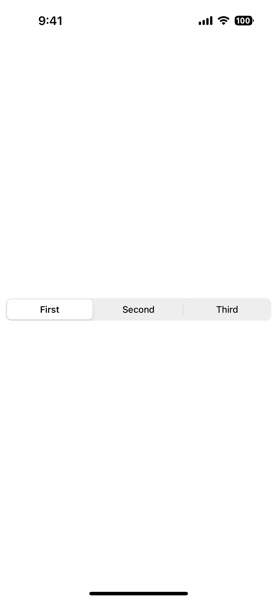
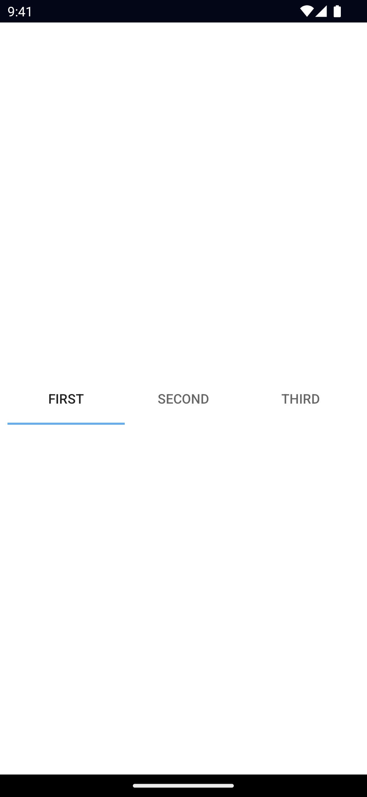

`<SegmentedBar>` is a UI bar component that displays a set of buttons for discrete selection.

<DeviceFrame type="ios">

</DeviceFrame>
<DeviceFrame type="android">

</DeviceFrame>

<<< @/../examples/typescript/src/ui/SegmentedBar/template.xml#example

## Props

### items

```ts
items: SegmentedBarItem[]
```

An array of items to be displayed in the SegmentedBar.

### selectedIndex

```ts
selectedIndex: number
```

Gets or sets the index of the selected item.

### selectedBackgroundColor

```ts
selectedBackgroundColor: Color
```

Gets or sets the background color of the selected item.

To set the background color of the entire bar, use `backgroundColor`.

See [Color](/api/class/Color).

### ...Inherited

For additional inherited properties, refer to the [API Reference](/api/class/SegmentedBar).

## SegmentedBarItem Props

### title

```ts
title: string
```

Gets or sets the title of the SegmentedBarItem.

## Events

### selectedIndexChanged

```ts
on('selectedIndexChanged', (args: EventData) => {
  const segmentedBar = args.object as SegmentedBar
  console.log('SegmentedBar index changed to:', segmentedBar.selectedIndex)
})
```

Emitted when an item in the SegmentedBar is tapped.

## Native component

- Android: [`android.widget.TabHost`](https://developer.android.com/reference/android/widget/TabHost.html)
- iOS: [`UISegmentedControl`](https://developer.apple.com/documentation/uikit/uisegmentedcontrol)
