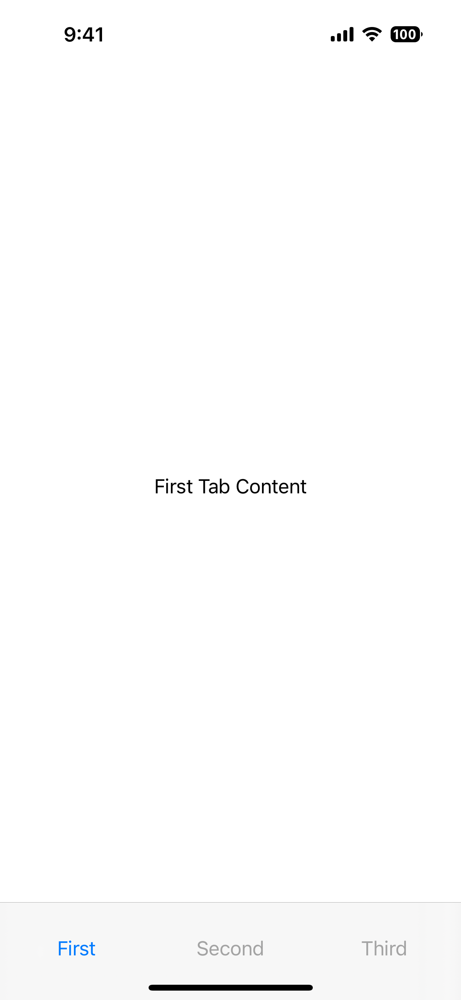
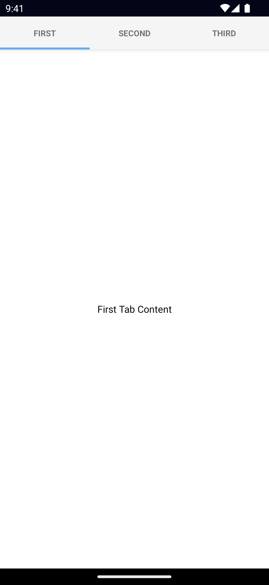

`<TabView>` is a UI component that shows content grouped into tabs and lets users switch between them.

<DeviceFrame type="ios">

</DeviceFrame>
<DeviceFrame type="android">

</DeviceFrame>

<Tabs>
<Tab flavor="typescript">

<<< @/../examples/typescript/src/ui/TabView/template.xml#example

</Tab>
<Tab flavor="angular">

<<< @/../examples/angular/src/ui/TabView/component.html#example

</Tab>
<Tab flavor="react">

<<< @/../examples/react/src/components/ui/tabview.tsx#example

</Tab>
<Tab flavor="solid">

<<< @/../examples/solid/src/ui/tabview.tsx#example

</Tab>
<Tab flavor="svelte">

<<< @/../examples/svelte/app/components/ui/TabView.svelte#example

</Tab>
<Tab flavor="vue">

<<< @/../examples/vue/src/ui/TabView/component.vue#example

</Tab>
</Tabs>

## Props

### selectedIndex

```ts
selectedIndex: number
```

Gets or sets the currently selected tab.

Defaults to `0`.

### tabTextColor

```xml
tabTextColor: Color
```

Gets or sets the text color of the tab titles.

::: info Corresponding CSS property:

```css
.tab-view {
  tab-text-color: #fff;
}
```

:::

See [Color](/api/class/Color).

### tabTextFontSize

```ts
tabTextFontSize: number
```

Gets or sets the font size of the tab titles.

::: info Corresponding CSS property:

```css
.tab-view {
  tab-text-font-size: 24;
}
```

:::

### tabBackgroundColor

```ts
tabBackgroundColor: Color
```

Sets the background color of the tabs.

::: info Corresponding CSS property:

```css
.tab-view {
  tab-background-color: #3d5a80;
}
```

:::

See [Color](/api/class/Color).

### androidSelectedTabHighlightColor

```ts
androidSelectedTabHighlightColor: Color
```

Sets the underline color of the tabs. **Android only.**

::: info Corresponding CSS property:

```css
.tab-view {
   android-selected-tab-highlight-color:: #3d5a80;
}
```

:::

See [Color](/api/class/Color).

### androidTabsPosition

```ts
androidTabsPosition: 'top' | 'bottom'
```

Sets the position of the tabs. **Android only.**

Defaults to `top`.

### iosIconRenderingMode

```ts
iosIconRenderingMode: 'automatic' | 'alwaysOriginal' | 'alwaysTemplate'
```

Gets or sets the icon rendering mode on iOS. **iOS only.**

Defaults to `automatic`.

See [UIImage.RenderingMode](https://developer.apple.com/documentation/uikit/uiimage/renderingmode).

### ...Inherited

For additional inherited properties, refer to the [API Reference](/api/class/TabView).

## TabViewItem Props

### title

```ts
title: string
```

Gets or sets the title of the tab strip entry.

### textTransform

```ts
textTransform: TextTransformType // "initial" | "none" | "capitalize" | "uppercase" | "lowercase"
```

Gets or sets the text transform.

See [TextTransformType](/api/namespace/CoreTypes#texttransformtype).

Defaults to `initial`.

### iconSource

```ts
iconSource: string
```

Gets or sets the icon source of the tab strip entry.

Supported paths are `font://`, `res://`, `sys://` (iOS only), or an absolute path (eg. `~/assets/image.png`).

See [`Image`](/ui/image) for details on the different paths.

## Events

### selectedIndexChange

```ts
on('selectedIndexChanged', (args: EventData) => {
  const tabView = args.object as TabView
  console.log('TabView selectedIndex:', tabView.selectedIndex)
})
```

Emitted when the selected tab changes.

## Native component

- Android: [`androidx.viewpager.widget.ViewPager`](https://developer.android.com/reference/androidx/viewpager/widget/ViewPager)
- iOS: [`UITabBarController`](https://developer.apple.com/documentation/uikit/uitabbarcontroller)
