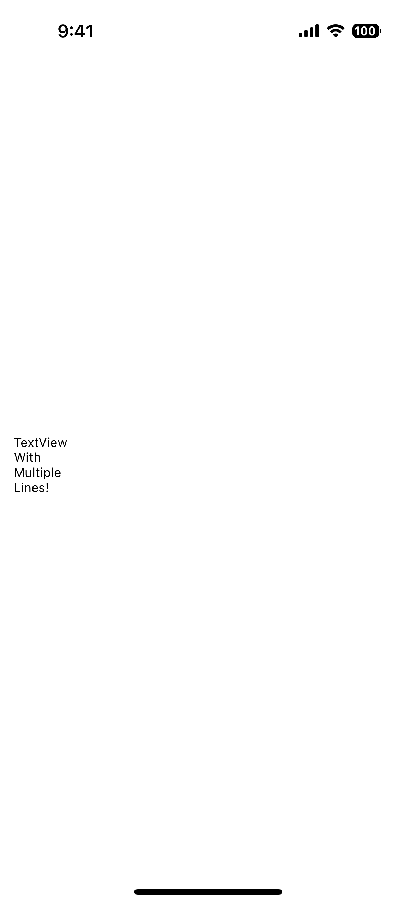
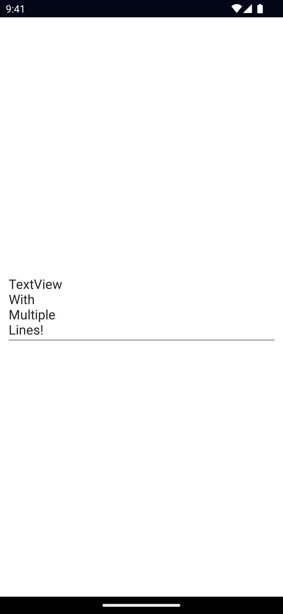

`<TextView>` is a UI component for multi-line text entry. When set to read-only, it can also be used to display multi-line text.

For single-line text input, see [TextField](/ui/text-field).

<DeviceFrame type="ios">

</DeviceFrame>
<DeviceFrame type="android">

</DeviceFrame>

<<< @/../examples/src/ui/TextView/template.xml#example
<<< @/../examples/src/ui/TextView/template.ts#example

## Examples

### Formatting text inside a TextView

If you need to style parts of the text, you can use a combination of a `FormattedString` and `Span` elements.

```xml
<TextView>
  <FormattedString>
    <Span text="This text has a " />
    <Span text="red " style="color: red" />
    <Span text="piece of text. " />
    <Span text="Also, this bit is italic, " fontStyle="italic" />
    <Span text="and this bit is bold." fontWeight="bold" />
  </FormattedString>
</TextView>
```

## Props

### text

```ts
text: string
```

Gets or sets the text of the TextView.

### hint

```ts
hint: string
```

<!-- textlint-disable terminology -->

Gets or sets the placeholder text for the TextView.

<!-- textlint-enable -->

### editable

```ts
editable: boolean
```

When set to `false` the TextView is read-only.

Defaults to `true`.

### keyboardType

```ts
keyboardType: CoreTypes.KeyboardType | number // "datetime" | "email" | "integer" | "number" | "phone" | "url"
```

Gets or sets the keyboard type shown when editing this TextView.

On iOS, any valid `UIKeyboardType` number works, for example:

```ts
keyboardType = 8 // UIKeyboardType.DecimalPad
```

See [CoreTypes.KeyboardType](/api/namespace/CoreTypes-KeyboardType), [UIKeyboardType](https://developer.apple.com/documentation/uikit/uikeyboardtype?language=objc).

### returnKeyType

```ts
returnKeyType: CoreTypes.ReturnKeyType // "done" | "go" | "next" | "search" | "send"
```

Gets or sets the label of the return key.

See [CoreTypes.ReturnKeyType](/api/namespace/CoreTypes-ReturnKeyType).

### isEnabled

Allows disabling the TextView. A disabled TextView does not react to user gestures or input.

Default value is `true`.

### maxLines

```ts
maxLines: number
```

Limits input to the specified number of lines.

### autocorrect

```ts
autocorrect: boolean
```

Enables or disables autocorrect.

### ...Inherited

For additional inherited properties not shown, refer to the [API Reference](/api/class/TextView).

## Methods

### focus()

```ts
focus(): boolean
```

Focuses the TextView and returns `true` if the focus was succeessful.

### dismissSoftInput()

```ts
dismissSoftInput(): void
```

Hides the on-screen keyboard.

## Events

### textChange

```ts
on('textChange', (args: PropertyChangeData) => {
  const textView = args.object as TextView
  console.log('TextView text changed:', args.value)
})
```

Emitted when the input text changes.

Event data type: [PropertyChangeData](https://docs.nativescript.org/api-reference/interfaces/propertychangedata)

### returnPress

```ts
on('returnPress', (args: EventData) => {
  const textView = args.object as TextView
  console.log('TextView return key pressed.')
})
```

Emitted when the return key is pressed.

### focus

```ts
on('focus', (args: EventData) => {
  const textView = args.object as TextView
  console.log('TextView has been focused')
})
```

Emitted when the TextView gains focus.

### blur

```ts
on('blur', (args: EventData) => {
  const textView = args.object as TextView
  console.log('TextView has been blured')
})
```

Emitted when the TextView loses focus.

## Native component

- Android: [`android.widget.EditText`](https://developer.android.com/reference/android/widget/EditText.html)
- iOS: [`UITextView`](https://developer.apple.com/documentation/uikit/uitextview)
