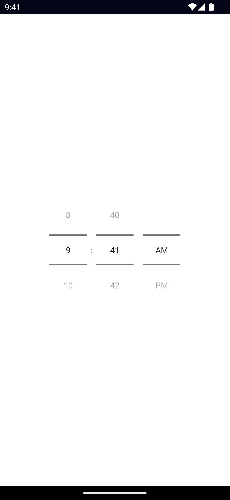

<!-- TODO: Add flavors -->

`<TimePicker>` is a UI component that lets users select time.

See also: [DatePicker](/ui/date-picker).

<DeviceFrame type="ios">

</DeviceFrame>
<DeviceFrame type="android">

</DeviceFrame>

<Tabs>
<Tab flavor="typescript">

<<< @/../examples/typescript/src/ui/TimePicker/template.xml#example

</Tab>
<Tab flavor="angular">

<<< @/../examples/angular/src/ui/TimePicker/component.html#example

</Tab>
<Tab flavor="react">

<<< @/../examples/react/src/components/ui/timepicker.tsx#example

</Tab>
<Tab flavor="solid">

<<< @/../examples/solid/src/ui/timepicker.tsx#example

</Tab>
<Tab flavor="svelte">

<<< @/../examples/svelte/app/components/ui/TimePicker.svelte#example

</Tab>
<Tab flavor="vue">

<<< @/../examples/vue/src/ui/TimePicker/component.vue#example

</Tab>
</Tabs>

## Props

### hour

```ts
hour: number
```

Gets or sets the selected hour.

Defaults to current hour.

### minute

```ts
minute: number
```

Gets or sets the selected minute.

Defaults to current minute.

### time

```ts
time: Date
```

Gets or sets the selected time.

Defaults to current time.

### minHour

```ts
minHour: number
```

Gets or sets the minimum selectable hour.

### maxHour

```ts
maxHour: number
```

Gets or sets the maximum selectable hour.

### minMinute

```ts
minMinute: number
```

Gets or sets the minimum selectable minute.

### maxMinute

```ts
maxMinute: number
```

Gets or sets the maximum selectable minute.

### minuteInterval

```ts
minuteInterval: number
```

Gets or sets the selectable minute interval.

Defaults to `1`.

### ...Inherited

For additional inherited properties not shown, refer to the [API Reference](/api/class/TimePicker)

## Events

### timeChange

```ts
on('timeChange', (args: PropertyChangeData) => {
  const timePicker = args.object as TimePicker
  console.log('Picked time:', data.value)
})
```

Emitted when the selected time changes.

## Native component

- Android: [`android.widget.TimePicker`](https://developer.android.com/reference/android/widget/TimePicker)
- iOS: [`UIDatePicker`](https://developer.apple.com/documentation/uikit/uidatepicker)
