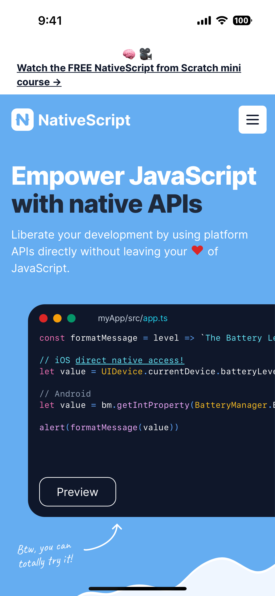
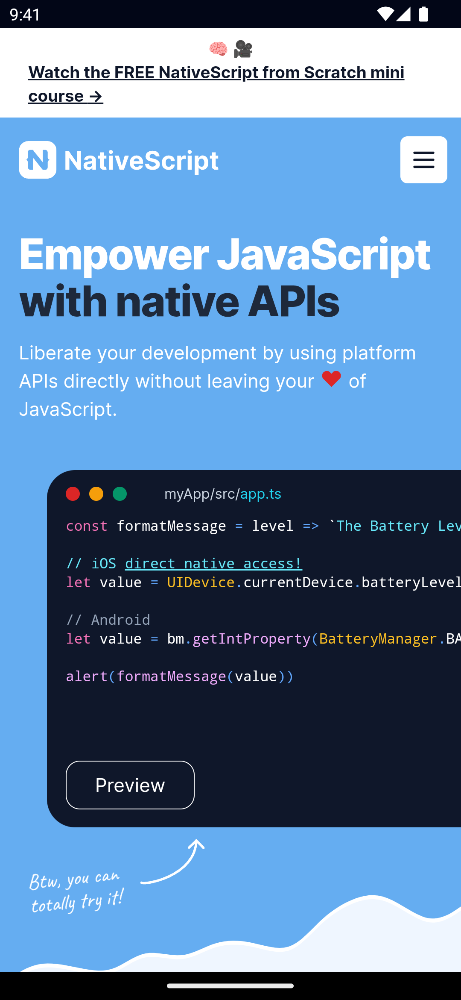

`<WebView>` is a UI component for rendering web content. The content can be from a remote URL, a local file, or an inline string.

See also: [HtmlView](/ui/html-view).

<DeviceFrame type="ios">

</DeviceFrame>
<DeviceFrame type="android">

</DeviceFrame>

<<< @/../examples/typescript/src/ui/WebView/template.xml#example

::: info Tip
To be able to use gestures inside a WebView on Android, [disable zoom controls](#disableZoom).
:::

## Props

### src

```ts
src: string
```

The source to load in the WebView. The value can be a valid HTTP URL, a path to a local HTML file, or a HTML string.

**Example:**

```ts
webView.src = 'https://nativescript.org/'
webView.src = '~/assets/html/index.html'
webView.src = '<div><h1>Some static HTML</h1></div>'
```

::: warning Insecure URLs
Depending on the software version of the device, insecure URLs may be blocked (`http://`), it's recommended to always use secure URLs (`https://`).
:::

### canGoBack

```ts
canGoBack: boolean
```

Gets a value indicating whether the WebView can navigate back.

### canGoForward

```ts
canGoForward: boolean
```

Gets a value indicating whether the WebView can navigate forward.

### disableZoom {#disableZoom}

```ts
disableZoom: boolean
```

Disable zooming in the WebView.

### iosAllowInlineMediaPlayback

```ts
iosAllowInlineMediaPlayback: boolean
```

Enables inline media playback on iOS. By default, WebView forces iPhone into fullscreen media playback. **iOS only.**

### ...Inherited

For additional inherited properties not shown, refer to the [API Reference](/api/class/WebView)

## Methods

### stopLoading()

```ts
stopLoading(): void
```

Stops loading the current content (if any).

### goBack()

```ts
goBack(): void
```

Navigates the WebView back.

### goForward()

```ts
goForward(): void
```

Navigates the WebView forward.

### reload()

```ts
reload(): void
```

Reloads the current url.

## Events

### loadStarted

```ts
on('loadStarted', (args: EventData) => {
  const webView = arg.object as WebView

  console.log('WebView started loading', args.url)
})
```

Emitted when the page has started loading in the `<WebView>`.

See [LoadEventData](/api/interface/LoadEventData).

### loadFinished

```ts
on('loadFinished', (args: EventData) => {
  const webView = arg.object as WebView

  console.log('WebView finished loading', args.url)
})
```

Emitted when the page has started loading in the `<WebView>`.

See [LoadEventData](/api/interface/LoadEventData).

## Native component

- Android: [`android.webkit.WebView`](https://developer.android.com/reference/android/webkit/WebView)
- iOS: [`WKWebView`](https://developer.apple.com/documentation/webkit/wkwebview)
